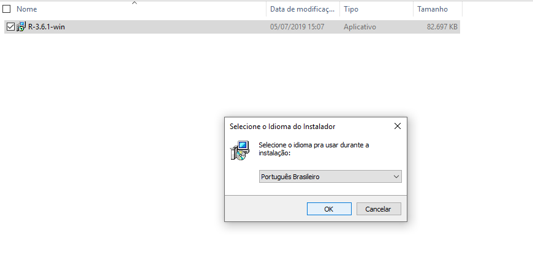
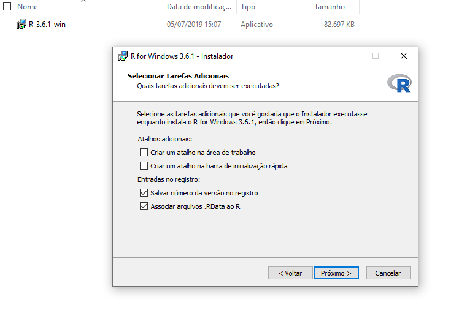
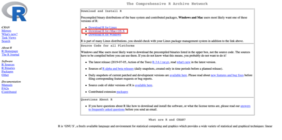
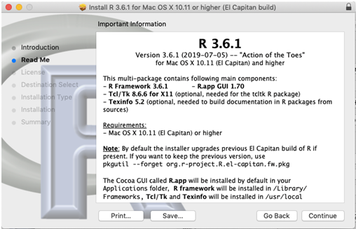
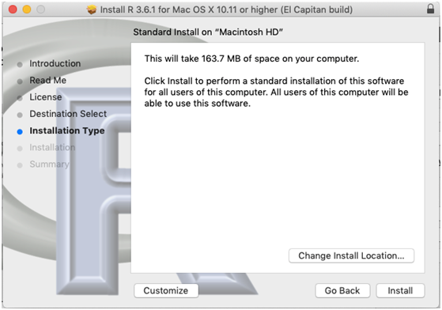
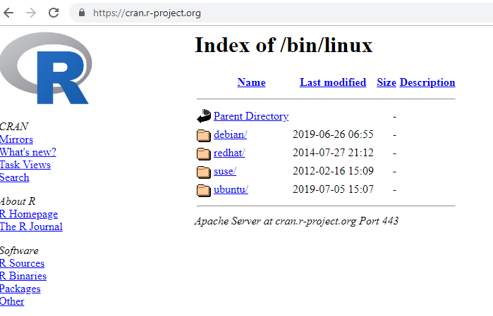
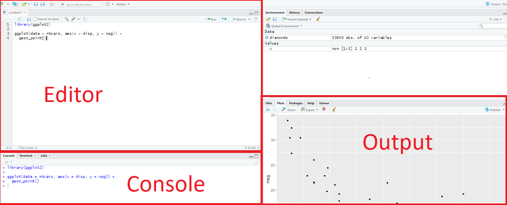

# Introdução  {#intro}

A Estatística é a ciência que engloba métodos para coleta, organização, descrição, análise e interpretação de dados, sendo estes estruturados (as estruturas usuais de bases de dados) ou não estruturados (como arquivos de textos, páginas da web, e-mails, mídias sociais etc). Assim, podemos dizer que por meio da Estatística transformamos dados em informações para o auxílio de tomadas de decisões em situações de incerteza. 

Devido à alta capacidade de armazenamento das mídias e ao uso generalizado de computadores, muitos dados estão sendo coletados e o mundo dependendo cada vez mais deles para criar conhecimento, obter informações relevantes e prever melhor o futuro. No seu livro _Homo Deus_, de 2016, Yuval Noah Harari argumenta que todos as estruturas políticas e sociais podem ser vistas como sistemas de processamento de dados e que daí surge a religião dataísmo: "O dataísmo declara que o universo consiste em fluxos de dados e que o valor de qualquer fenômeno ou entidade é determinada pela contribuição que dá para o processamento de dados" (https://pt.wikipedia.org/wiki/Dataísmo).

Na pesquisa médica, em especial, são realizados estudos experimentais ou observacionais, levando à coleção de dados em que o objetivo da investigação é responder a uma questão científica. Para exemplificar esse ponto, vamos considerar um problema da área da medicina obstétrica que consiste no estudo da idade gestacional do parto em gestações gemelares (de gêmeos).

A importância de se estudar a idade gestacional do parto em gestação gemelares se deve pelo elevado risco de prematuridade (parto antes de 37 semanas) em gestações múltiplas. Entre as mulheres com gestação gemelar, o parto prematuro que ocorre antes das 37 semanas é observado em mais de 50\% dos casos e quase 12\% antes de 32 semanas completas de gestação [@silva1995prematuridade]. Devido a esse fato, observa-se uma taxa de mortalidade neonatal nas gestações gemelares de 6,4 vezes maior que nas gestações únicas (único feto), e essa taxa se mantém inalterada desde o ano de 2000 [@into2009child].

O trabalho de parto é consequência de eventos fisiológicos, como por exemplo, o predomínio da ação estrogênica em relação à progesterônica. A progesterona é um hormônio fundamental para a manutenção da gravidez, e um declínio na ação da progesterona é fundamental para o início do parto na maioria das espécies de mamíferos, incluindo os primatas [@astle2003involvement].  A progesterona está presente na natureza, em humanos e em animais (ovários, placenta, testículos e adrenal). Os seus precursores estão presentes nos vegetais, como a soja e o inhame, e constituem a principal fonte de produção da progesterona natural comercializada [@de2016prenatal].

Em gestações com colo curto, também com risco de prematuridade, o uso de progesterona comercializada é um tratamento conhecido na literatura para diminuir o risco de prematuridade. No projeto liderado pela obstetra e profa. Dra. Maria de Lourdes Brizot (http://lattes.cnpq.br/6273300603065618), a pergunta que se deseja responder é: 

 > O uso de progesterona diminui o risco de prematuridade em gestações gemelares?

Para responder essa pergunta, foi realizado um estudo prospectivo, randomizado, duplo
ensaio cego controlado por placebo que envolveu 390 
gestações gemelares sem histórico de parto prematuro. Mulheres com gestações gemelares entre 18 e 21 semanas e 6 dias de gestação foram designadas aleatoriamente em um de dois grupos:


* **Tratamento com progesterona** - progesterona vaginal diária (200 mg) até 34 semanas e 6 dias de gestação (ou até o parto se este ocorreu antes de 35 semanas). 

* **Tratamento placebo** - óvulos de placebo até 34 semanas e 6 dias de gestação (ou até o parto se este ocorreu antes de 35 semanas). 


Um comentário importante: placebo é toda e qualquer substância sem propriedades farmacológicas, administrada a pessoas ou grupo de pessoas como se tivesse propriedades terapêuticas. A palavra "placebo" vem do latim _placere_, que significa "agradar". Neste material não entraremos em detalhes sobre tipos de estudo. Para esse assunto e maiores discussões sobre placebo, recomendamos ver os slides "Tipos de estudos" disponível em https://daslab-ufes.github.io/materiais/. 

Voltando ao problema da progesterona, houve 6 perdas de segmento no grupo progesterona e 4 perdas de segmento no grupo placebo, resultando em $n=189$ no grupo progesterona e $n=191$ no grupo placebo. 

A variação nos dados faz com que a resposta não seja óbvia. Precisamos de ferramentas estatísticas para determinar se a
diferença é tão grande que devemos rejeitar a noção de que foi devido ao acaso.

No caso do estudo da progesterona, a diferença na proporção
de prematuridade do grupo progesterona e do grupo controle é devido a flutuações aleatórias ou é um indício de que o uso de progesterona é um protocolo mais eficiente?

A seguir são apresentadas as bases de dados que consideramos no decorrer deste material. 

## Bases de dados

### Gestações gemelares {#dados_gemelares}
A base de dados fictícia de gestações gemelares é baseada no estudo citado anteriormente sobre o efeito do uso de progesterona em gestações gemelares. Sabe-se que os históricos obstétrico e clínico da gestante e informações da gestação também podem influenciar a idade gestacional do parto, e por esse motivo também foram avaliados. São as características observadas:


```{r dic1, echo=FALSE, fig.cap="Variáveis da base de dados gestações gemelares.", out.width = '100%'}
knitr::include_graphics("figures/dicionario_dados_progest.png")
```


```{r, eval=TRUE,include=FALSE,echo=TRUE,error=TRUE}
library(readxl)
dados <- read_excel(path = "dataset/dados_gemelares.xlsx",na="NA")
```

A seguir está o exemplo de como os dados de 5 indivíduos estão tabulados. 
```{r, eval=TRUE,include=TRUE,echo=FALSE,error=TRUE}
knitr::kable(dados[20:24,])
```

Essa base de dados está disponível em https://daslab-ufes.github.io/materiais/, chamado de "Dados gemelares". 

### Gestações gemelares - depressão e amamentação
Essa base de dados fictícia apresenta informações sobre depressão e amamentação das mesmas observações consideradas na base de dados Gestações gemelares, apresentada no item anterior. 

O questionário de depressão EDPS foi respondido pelas gestantes no primeiro trimestre gestacional e respondido novamente pelas mesmas gestantes no quarto mês pós-parto. Esse questionário retorna um escore (de 0 a 30 pontos), em que quanto maior seu valor, maior indicador de depressão. 

Sobre a amamentação, foram divididos três grupos a depender das orientações sobre a amamentação recebidas durante o pré-natal. O grupo 1 é formado pelas gestantes que tiveram mentorias durante o pré-natal e acompanhamento nas amamentações das primeiras semanas; o grupo 2 é formado pelas gestações que receberam apenas orientações durante o pré-natal e no grupo 3 estão as gestantes que não receberam orientações sobre amamentação. 

São as características observadas:

```{r dic2, echo=FALSE, fig.cap="Variáveis da base de dados gestações gemelares - depressão e amamentação.", out.width = '100%'}
knitr::include_graphics("figures/dicionario_dados_progest2.png")
```


```{r, eval=TRUE,include=FALSE,echo=TRUE,error=TRUE}
library(readxl)
dados2 <- read_excel(path = "dataset/dados_gemelares_2.xlsx",na="NA")
```

A seguir está o exemplo de como os dados de 5 indivíduos estão tabulados. 
```{r, eval=TRUE,include=TRUE,echo=FALSE,error=TRUE}
knitr::kable(dados2[17:21,])
```

Essa base de dados está disponível em https://daslab-ufes.github.io/materiais/, chamado de "Dados gemelares - depressão e amamentação". 

## Sobre o software R
R é um ambiente computacional e uma linguagem de programação para manipulação, análise e visualização de dados. É considerado um dos melhores ambiente computacional para essa finalidade. O R é mantido pela [R Development Core Team](https://cran.r-project.org/) e está disponível para diferentes sistemas operacionais: Linux, Mac e Windows.

O software é livre, ou seja, gratuito, com código aberto em uma linguagem acessível. Nele, estão implementadas muitas metodologias estatísticas. Muitas dessas fazem parte do ambiente base de R e outras acompanham o ambiente sob a forma de pacotes, o que torna o R altamente expansível. Os pacotes são bibliotecas com dados e funções para diferentes áreas do conhecimento relacionados à estatística e áreas afins, devidamente documentados.

O R possui uma comunidade extremamente ativa, engajada desde o aprimoramento de ferramentas e desenvolvimento de novas bibliotecas, até o suporte aos usuários. Sobre o desenvolvimento de novas bibliotecas, um pesquisador em Estatística que desenvolve um novo modelo estatístico pode disponibilizá-lo em um pacote acessível a que se interessam pelo modelo. 

Além disso, a disponibilidade e compartilhamento da pesquisa em um pacote no R é uma boa prática quando falamos de reprodutibilidade na Ciência. Ainda nesse ponto, realizar as análises de uma pesquisa aplicada em um programa livre e acessível a todos é um dos principais pontos para permitir reprodutibilidade. 

Ao optar por programar em R também implica na escolha de uma IDE (Integrated Development Environment) que, na grande maioria dos casos, será o [RStudio](https://rstudio.com). O RStudio é um conjunto de ferramentas integradas projetadas para editar e executar os códigos em R. Assim, quando for o interesse utilizar o R, só precisa abrir o RStudio (R é automaticamente carregado). 

Para instalação do R e do RStudio, veja a Seção que segue. 

## Instalação R e RStudio 

### Instalação R

Nessa Seção, vamos apresentar como instalar o R e o RStudio para os três sistemas operacionais: Windows, MAC e Linux, respectivamente. 

#### Para Windows  
Os passos para instalar o R quando o sistema operacional é Windows são os seguintes:

1)	Entre neste [link](https://cran.r-project.org/bin/windows/base/) para acessar a página do R e clique em Download, como no link destacado em retângulo vermelho na Figura \@ref(fig:windows1). Note que o 3.6.1 é o número da versão mais recente disponível no momento da construção desse material (5/7/19). 

```{r windows1, echo=FALSE, fig.cap="Download R para Windows", out.width = '100%'}
knitr::include_graphics("figures/install_Windows.png")
```

2) Salve o arquivo de instalação em algum caminho de interesse do seu computador. Por exemplo, na Figura \@ref(fig:windows2) mostra que a pasta é “Downloads”. 

```{r windows2, echo=FALSE, fig.cap="Instalador", out.width = '100%'}

```

3)	Clique duas vezes com o botão esquerdo no instalador para iniciar a instalação. O próximo passo é escolher a língua para instalação. Na Figura \@ref(fig:windows3) abaixo é português. 

```{r windows3, echo=FALSE, fig.cap="Escolha da lingua para instalação", out.width = '100%'}

```

4) Clique em “Próximo” nas próximas janelas, como nas Figuras \@ref(fig:windows4) a \@ref(fig:windows9). 

```{r windows4, echo=FALSE, fig.cap="Próximo ", out.width = '100%'}

```

```{r windows5, echo=FALSE, fig.cap="\\label{fig:windows5}Próximo ", out.width = '100%'}
knitr::include_graphics("figures/install_Windows5.png")
```

```{r windows6, echo=FALSE, fig.cap="\\label{fig:windows6}Próximo ", out.width = '100%'}

```

```{r windows7, echo=FALSE, fig.cap="\\label{fig:windows7}Próximo ", out.width = '100%'}

```

```{r windows8, echo=FALSE, fig.cap="\\label{fig:windows8}Próximo ", out.width = '100%'}
knitr::include_graphics("figures/install_Windows8.png")
```

```{r windows9, echo=FALSE, fig.cap="\\label{fig:windows9}Próximo ", out.width = '100%'}

```

5)	Pronto, agora o software R será instalado, como na Figura \@ref(fig:windows10). Quando terminar, aparecerá uma janela como apresentado na Figura \@ref(fig:windows11).

```{r windows10, echo=FALSE, fig.cap="\\label{fig:windows10}Instalação do R", out.width = '100%'}
knitr::include_graphics("figures/install_Windows10.png")
```

```{r windows11, echo=FALSE, fig.cap="\\label{fig:windows11}Pronto: R instalado", out.width = '100%'}
knitr::include_graphics("figures/install_Windows11.png")
```

#### Para MAC
Os passos para instalar o R quando o sistema operacional é OS X (Mac) são os seguintes:

1) Entre no [site](https://cran.r-project.org) e clique em Download R for (MAC) OS X, conforme destacado abaixo em retângulo vermelho na Figura \@ref(fig:mac1).


```{r mac1, echo=FALSE, fig.cap="\\label{fig:mac1} Download R para Mac", out.width = '100%'}

```

2) Baixe o pacote R-3.6.1.pkg clicando no link indicado no retângulo vermelho na Figura \@ref(fig:mac2). Note que o 3.6.1 é o número da versão mais recente disponível no momento da confecção deste material.

```{r mac2, echo=FALSE, fig.cap="\\label{fig:mac2} Download R para Mac ", out.width = '100%'}
knitr::include_graphics("figures/mac_R_2.png")
```

3) Caso você não tenha configurado a pasta de descargas, o pacote será baixado na pasta “Downloads”, como mostrado na seguinte Figura \@ref(fig:mac3). Observe que dois arquivos são baixados, clique duas vezes no arquivo "R-3.6.1.pkg" para abrir o assistente de instalação que o guiará durante o processo.

```{r mac3, echo=FALSE, fig.cap="\\label{fig:mac3} Pasta para instalação", out.width = '100%'}
knitr::include_graphics("figures/mac_R_3.png")
```

4) Acompanhe os passos indicados pelo instalador (Figura \@ref(fig:mac4)).

```{r mac4, echo=FALSE, fig.cap="\\label{fig:mac4} Instalação", out.width = '100%'}

```

5) Deve concordar com os termos da licença, clique em “Agree” (Figura \@ref(fig:mac5)).
```{r mac5, echo=FALSE, fig.cap="\\label{fig:mac5} Instalação", out.width = '100%'}

```

6) Selecione o lugar onde instalará o programa, no caso de ter o disco particionado e assim desejar instalar em uma parte específica. Caso contrário, continue (Figura \@ref(fig:mac6) e \@ref(fig:mac7)).

```{r mac6, echo=FALSE, fig.cap="\\label{fig:mac6} Instalação", out.width = '100%'}

```

```{r mac7, echo=FALSE, fig.cap="\\label{fig:mac7} Instalação", out.width = '100%'}

```

7)	Para finalizar a instalação, o assistente lhe pedirá nome de usuário e senha do seu notebook, como apresentado na Figura \@ref(fig:mac8).

```{r mac8, echo=FALSE, fig.cap="\\label{fig:mac8} Instalação", out.width = '100%'}
knitr::include_graphics("figures/mac_R_8.png")
```

8) Pronto, agora o software R será instalado, como na Figura \@ref(fig:mac9). Quando terminar, aparecerá uma janela como apresentado na Figura \@ref(fig:mac10).

```{r mac9, echo=FALSE, fig.cap="\\label{fig:mac9} Instalação", out.width = '100%'}
knitr::include_graphics("figures/mac_R_9.png")
```


```{r mac10, echo=FALSE, fig.cap="\\label{fig:mac10} Instalação", out.width = '100%'}

```


#### Para Linux
A instalação do R no Linux depende da distribuição utilizada. Entre neste [link](https://cran.r-project.org/) para acessar a página do R e clique em Download R for Linux, como no link destacado em retângulo vermelho na Figura \@ref(fig:linux1). Em seguida, clique no link referente à distribuição utilizada (Figura \@ref(fig:linux2)).

```{r linux1, echo=FALSE, fig.cap="\\label{fig:linux1}Download em Linux", out.width = '100%'}

```

```{r linux2, echo=FALSE, fig.cap="\\label{fig:linux2}Download em Linux", out.width = '100%'}

```

### Instalação RStudio

O RStudio é um conjunto de ferramentas integradas projetadas (IDE - Integrated Development Environment) da linguagem R para auxiliar na produtividade ao utilizar o R. 


#### Para Windows

1) Entre neste [link](https://www.rstudio.com/products/rstudio/download/) e clique em Download como em destaque na Figura \@ref(fig:rswindows1). 

```{r rswindows1, echo=FALSE, fig.cap="\\label{fig:rswindows1}Site para download do RStudio", out.width = '100%'}

```

2) Clique no instalador em destaque na Figura \@ref(fig:rswindows2).

```{r rswindows2, echo=FALSE, fig.cap="\\label{fig:rswindows2}Link para download do RStudio", out.width = '100%'}
knitr::include_graphics("figures/install_Rstudio2.png")
```

3) Ao clicar no link, será feito o download do instalador e salvo na pasta de interesse. No caso da Figura \@ref(fig:rswindows3), o instalador está na pasta Downloads. Dê dois cliques no botão esquerdo no arquivo para iniciar o download do arquivo. 

```{r rswindows3, echo=FALSE, fig.cap="\\label{fig:rswindows3} Instalador", out.width = '100%'}

```

4) Clique em “Próximo” nas próximas janelas e na última “Instalar”, como nas Figuras \@ref(fig:rswindows4) a \@ref(fig:rswindows6). 

```{r rswindows4, echo=FALSE, fig.cap="\\label{fig:rswindows4} Instalação", out.width = '100%'}
knitr::include_graphics("figures/install_Rstudio4.png")
```

```{r rswindows5, echo=FALSE, fig.cap="\\label{fig:rswindows5} Instalação", out.width = '100%'}
knitr::include_graphics("figures/install_Rstudio5.png")
```

```{r rswindows6, echo=FALSE, fig.cap="\\label{fig:rswindows6} Instalação", out.width = '100%'}
knitr::include_graphics("figures/install_Rstudio6.png")
```

5)	Pronto, a instalação será iniciada, como na Figura \@ref(fig:rswindows7). 

```{r rswindows7, echo=FALSE, fig.cap="\\label{fig:rswindows7} Instalação", out.width = '100%'}
knitr::include_graphics("figures/install_Rstudio7.png")
```

#### Para MAC

1) Entre neste [link](https://www.rstudio.com/products/rstudio/download/) e clique em Download como em destaque na Figura \@ref(fig:rsmac1). 

```{r rsmac1, echo=FALSE, fig.cap="\\label{fig:rsmac1}Site para download do RStudio", out.width = '100%'}

```

2)	Clique no instalador como destacado na Figura \@ref(fig:rsmac2).

```{r rsmac2, echo=FALSE, fig.cap="\\label{fig:rsmac2}Site para download do RStudio para Mac", out.width = '100%'}

```


3)	Ao clicar no link, será feito o download do instalador e salvo na pasta de interesse. Caso você não tenha configurado a pasta de descargas, o instalador ficará na pasta “Downloads”, como na Figura \@ref(fig:rsmac3). 

```{r rsmac3, echo=FALSE, fig.cap="\\label{fig:rsmac3} Instalador salvo em pasta", out.width = '100%'}
knitr::include_graphics("figures/mac_RSt_2.png")
```

4) Clicando duas vezes no arquivo “RStudio-1.2.1335.dmg” (versãos mais atual do RStudio), será feita a descarga do mesmo abrindo a janela conforme na Figura \@ref(fig:rsmac4). Clique no aplicativo de RStudio destacado em vermelho também na Figura \@ref(fig:rsmac4).

```{r rsmac4, echo=FALSE, fig.cap="\\label{fig:rsmac4} Instalação", out.width = '100%'}

```

5)	O instalador pode perguntar se está seguro que o aplicativo será baixado da internet e clique em “Open” (Figura \@ref(fig:rsmac5)).

```{r rsmac5, echo=FALSE, fig.cap="\\label{fig:rsmac5} Instalação", out.width = '100%'}

```

6)	Pronto! Imediatamente abre o RStudio, como na Figura \@ref(fig:rsmac6), e você já pode utilizá-lo.

```{r rsmac6, echo=FALSE, fig.cap="\\label{fig:rsmac6} Instalação", out.width = '100%'}

```

#### Para Linux

1) Entre neste [link](https://www.rstudio.com/products/rstudio/download/) e clique em Download como em destaque na Figura \@ref(fig:rslinux1). 

```{r rslinux1, echo=FALSE, fig.cap="\\label{fig:rslinux1}Site para download do RStudio", out.width = '100%'}

```

2)  Clique no link referente à distribuição utilizada (Figura \@ref(fig:rslinux2)).
```{r rslinux2, echo=FALSE, fig.cap="\\label{fig:rslinux2} Download do RStudio", out.width = '100%'}

```

## Primeiros passos com R e RStudio

### Primeiros contatos com RStudio

O RStudio é um conjunto de ferramentas integradas projetadas (IDE - Integrated Development Environment) da linguagem R para editar e executar os códigos em R.


Tem quatro áreas, conforme a Figura \@ref(fig:telarstudio1).

```{r telarstudio1, echo=FALSE, fig.cap="\\label{fig:rstudio1} Visualização do RStudio", out.width = '100%'}

```

A seguir descrevemos melhor os painéis e abas do RStudio:

* Editor/Scripts: é onde escrever os códigos. Arquivos do tipo .R. 

* Console: executar os comandos e ver os resultados. 

* Enviroment: painel com todos os objetos criados.

* History: história dos comandos executados. 

* Files: navegar em pastas e arquivos. 

* Plots: onde os gráficos serão apresentados.

* Packages: pacotes instalados (sem ticar) e habilitados (ticados). 

* Help: retorna o tutorial de ajuda do comando solicitado com help() ou ?comando. Ver melhor como pedir ajuda no R no final deste capítulo. 

O usuário pode alterar a aparência do RStudio, como fonte e cor. Como exemplo, as Figuras \@ref(fig:telarstudio2) e \@ref(fig:telarstudio3) apresentam os passos para mudar o tema do script. No exemplo, deixar com fundo preto. 

```{r telarstudio2, echo=FALSE, fig.cap="\\label{fig:rstudio2} Ferramentas de aparência do RStudio", out.width = '100%'}

```

```{r telarstudio3, echo=FALSE, fig.cap="\\label{fig:rstudio3} Ferramentas de aparência do RStudio", out.width = '100%'}

```

Ainda no menu Tools --> Global Options --> Pane Layout, o usuário pode organizar a ordem dos quadrantes do RStudio, como apresentado nas Figuras \@ref(fig:telarstudio4), \@ref(fig:telarstudio5) e \@ref(fig:telarstudio6). No exemplo, o painel Console foi transferido para o lado do painel Script, o que facilita a visualização dos comandos rodados.  

```{r telarstudio4, echo=FALSE, fig.cap="\\label{fig:rstudio4} Ferramentas de aparência do RStudio", out.width = '100%'}
knitr::include_graphics("figures/rstudio4.png")
```

```{r telarstudio5, echo=FALSE, fig.cap="\\label{fig:rstudio5} Ferramentas de aparência do RStudio", out.width = '100%'}
knitr::include_graphics("figures/rstudio5.png")
```

```{r telarstudio6, echo=FALSE, fig.cap="\\label{fig:rstudio6} Ferramentas de aparência do RStudio", out.width = '100%'}
knitr::include_graphics("figures/rstudio6.png")
```


#### Projetos

Uma funcionalidade importante é a criação de projetos, permitindo dividir o trabalho em múltiplos ambientes, cada um com o seu diretório, documentos e workspace.

Para criar um projeto, os seguintes passos podem ser seguidos:

1) Clique na opção “File” do menu, e então em “New Project”.

2) Clique em “New Directory”.

3) Clique em “New Project”.

4) Escreva o nome do diretório (pasta) onde deseja manter seu projeto, exemplo: “my_project”.

5) Clique no botão “Create Project”.

Para criar um novo script para escrever os códigos, vá em File -> New File -> R Script

#### Boas práticas

Comente bem o seu código: é possível fazer comentários usando o símbolo '#'. É sempre bom explicar o que uma variável armazena, o que uma função faz, por que alguns parâmetros são passados para uma determinada função, qual é o objetivo de um trecho de código etc.

Evite linhas de código muito longas: usar linhas de código mais curtas ajuda na leitura do código.

Escreva um código organizado. Por exemplo, adote um padrão no uso de minúsculas e maiúsculas, uma lógica única na organização de pastas e arquivos, pode ser adotada uma breve descrição (como comentário) indicando o que um determinado script faz.

Carregue todos os pacotes que irá usar sempre no início do arquivo: quando alguém abrir o seu código será fácil identificar quais são os pacotes que devem ser instalados e quais dependências podem existir.

### Primeiros passos no R

Posso escrever o código no Script e submetê-lo ao apertar o botão "Run" ou com o atalho no teclado Cmd/Ctrl+Enter. 

#### R como calculadora 

1) Operadores

```{r calc1, eval=TRUE,include=TRUE}
#adição
10+15
#subtração
10-2
#multiplicação
2*10
#divisão
30/2
#raiz quadrada
sqrt(4)
#potência
2^2
```

Se você digitar um comando incompleto, como 10 *, o R mostrará um +. Isso não tem a ver com a soma e apenas que o R está esperando você completar seu comando. Termine seu comando ou aperte Esc para recomeçar. 

Vale também ressaltar que se você digitar um comando que o R não reconhece, ele retornará uma mensagem de erro e você pode digitar outro comando normalmente em seguida. 


#### Atribuição 

Podemos salvar valores dentro de um objeto, que é simplemente um nome que guarda um valor, vetor, matriz, lista ou base de dados. 

Para atribuir a um objeto, o sinal de atribuição é `=` ou `<-` (preferível). 

Exemplos:
```{r, eval=TRUE,include=TRUE,echo=TRUE,error=TRUE}
x <- 10/2
x
X
```

Por que tivemos um erro acima?

O R é case sensitive, isto é, faz a diferenciação entre as letras minúsculas e maiúsculas. Portanto, x é diferente de X. 

#### Objetos em R

Existem cinco classes básicas no R:

* character: "UAH!" 

* numeric: 0.95 (números reais)

* integer: 100515 (inteiros)

* complex: 2 + 5i (números complexos, a + bi)

* logical: TRUE (booleanos, TRUE/FALSE)

Vamos atribuir a x a string banana. 
```{r, eval=TRUE,include=TRUE,echo=TRUE,error=TRUE}
x <- banana 
x <- "banana"
x
```
O primeiro caso (x <- banana) não deu certo, pois ele entendeu que estamos atribuindo a x outro objeto banana, que não foi declarado. Para atribuir o string banana a x, precisamos colocar entre aspas ou aspas simples. Uma string sem aspas é entendido como um objeto, veja abaixo:
```{r, eval=TRUE,include=TRUE,echo=TRUE,error=TRUE}
banana <- 30
x <- banana
x
```

Para saber a classe de um objeto, use a função `class()`.

```{r, eval=TRUE,include=TRUE,echo=TRUE,error=TRUE}
y <- "ola"
class(y)

x <- 2.5
class(x)
```

#### Apagar objetos
E se eu quiser apagar um objeto?

```{r, eval=TRUE,include=TRUE,echo=TRUE,error=TRUE}
x <- 20
x
remove(x)
x
```

E se eu quiser limpar o console - apaga todos os objetos atribuídos até aqui:
```{r, eval=TRUE,include=TRUE,echo=TRUE,error=TRUE}
rm(list=ls())
```


#### Vetor
 Como atribuir vários valores a um objeto?  Para entrar com vários números (ou nomes, ou qualquer outro grupo de coisas), precisamos usar uma função para dizer ao programa que os valores serão combinados em um único vetor.
```{r, eval=TRUE,include=TRUE,echo=TRUE,error=TRUE}
x <- c(2,3,4)
x
y <- seq(1,10)
y
z <- rep(1,10)
z
a <- 1:10
a
bicho <-c("macaco","pato","galinha","porco")
bicho
```
E se quisermos visualizar o conteúdo da posição 2 no vetor bicho?
```{r, eval=TRUE,include=TRUE,echo=TRUE,error=TRUE}
bicho[2]
```

As operações vetoriais podem ser realizadas de maneira bastante intuitiva. Como exemplos:
```{r, eval=TRUE,include=TRUE,echo=TRUE,error=TRUE}
x <- c(2,3,4)
x
ops <- x-1
ops
k <- x*2
k
```

Vamos agora considerar um vetor de pesos em kg e altura em metros de 6 pessoas. 
```{r, eval=TRUE,include=TRUE,echo=TRUE,error=TRUE}
peso <- c(62, 70, 52, 98, 90, 70)
peso
altura <- c(1.70, 1.82, 1.75, 1.94, 1.84, 1.61)
altura
```
Vale mencionar que o separador de decimais no R é . (ponto)! 

Como calcularia o IMC? Lembrando que o IMC é dado pelo peso (em kg) dividido pela altura (em metros) ao quadrado. 
```{r, eval=TRUE,include=TRUE,echo=TRUE,error=TRUE}
imc <- peso/(altura^2)
imc
```

Para saber o tamanho do vetor, use a função `length()`. 
```{r, eval=TRUE,include=TRUE,echo=TRUE,error=TRUE}
length(imc)
```

#### Matrizes
Matrizes são vetores numéricos com duas dimensões, que são simplesmente a linha e a coluna às quais o elemento pertence.
```{r, eval=TRUE,include=TRUE,echo=TRUE,error=TRUE}
x <- matrix(seq(1,16), nrow=4,ncol=4)
x
```
Note que os números de 1 a 16 foram dispostos na matriz coluna por coluna ou seja, preenchendo de cima para baixo e depois da esquerda para a direita.

Como sei qual elemento está na segunda linha e terceira coluna da matriz x?
```{r, eval=TRUE,include=TRUE,echo=TRUE,error=TRUE}
x[2,3]

x[3,  ]   # seleciona a 3ª linha
x[ , 2]   # seleciona a 2ª coluna
x[1, 2]   # seleciona o elemento da primeira linha e segunda coluna
```

E se eu quiser substituir a primeira linha por (13,15,19,30)?

```{r, eval=TRUE,include=TRUE,echo=TRUE,error=TRUE}
x[1,] <- c(13,15,19,30)

x
```

Seja o vetor d:
```{r, eval=TRUE,include=TRUE,echo=TRUE,error=TRUE}
d <- c(128,124,213,234)
```
E se quisermos substituir a terceira coluna por d?
```{r, eval=TRUE,include=TRUE,echo=TRUE,error=TRUE}
x[,3] <- d
```
Qual a dimensão da matriz x?

Vimos que para vetor usamos o comando `length()`. Serve para matriz também? Vamos testar!
```{r, eval=TRUE,include=TRUE,echo=TRUE,error=TRUE}
length(x)
```
Note que retorna o número de colunas vezes o número de linhas (4*4=16). Mas o que quero saber é o numero de linhas e de colunas. Para isso, o comando é `dim()`.
```{r, eval=TRUE,include=TRUE,echo=TRUE,error=TRUE}
dim(x)
```

Para concatenar linhas em uma matriz, podemos usar o comando `rbind()`:
```{r, eval=TRUE,include=TRUE,echo=TRUE,error=TRUE}
vet <- c(2,20,12,34)
x2 <- rbind(x,vet)
x2
```

Para concatenar colunas em uma matriz, podemos usar o comando `cbind()`:
```{r, eval=TRUE,include=TRUE,echo=TRUE,error=TRUE}
v2 <- c(25,10,15,4) 
x3 <- cbind(x,v2)
x3
```

#### Fator
Fatores podem ser vistos como vetores de inteiros que possuem rótulos (labels). Eles são úteis para representar uma variável categórica (nominal e ordinal).
```{r, eval=TRUE,include=TRUE,echo=TRUE,error=TRUE}
sexo <- c("M", "H", "H", "H", "M", "M", "H")
sex <- as.factor(sexo)
sex
levels(sex)
```

#### Data frame
Trata-se de uma “tabela de dados” onde as colunas são as variáveis e as linhas são os registros. Essas colunas podem ser de classes diferentes. 

Essa é a grande diferença entre data.frame’s e matrizes (matriz é só numerica).

Posso criar um data frame no R com os vetores, por exemplo:
```{r, eval=TRUE,include=TRUE,echo=TRUE,error=TRUE}
ID <- seq(1,6)
pes <- c(62, 70, 52, 98, 90, 70)
alt <- c(1.70, 1.82, 1.75, 1.94, 1.84, 1.61)
imc <- pes/(alt^2)
dados <- data.frame(ID=ID,peso=pes,altura=alt, imc=imc)
dados
```

Posso pensar que o data frame tem a mesma ideia de matriz. Quero olhar os dados de altura, que sei que está na coluna 3. 
```{r, eval=TRUE,include=TRUE,echo=TRUE,error=TRUE}
dados[,3]
```
Mas existe uma maneira mais fácil de selecionar a variável de interesse sem ter que saber em qual coluna ela está. 

Por ser um data frame, posso usar `$` da seguinte maneira:
```{r, eval=TRUE,include=TRUE,echo=TRUE,error=TRUE}
dados$altura
```

Putz, esqueci de colocar a variável de grupo no data frame. Tenho que criar tudo de novo? Não:
```{r, eval=TRUE,include=TRUE,echo=TRUE,error=TRUE}
gr <- c(rep(1,3),rep(2,3))
dados$grupo <- gr

dados
```
Veja que no "dados$grupo" foi inserido o objeto "gr". Se "gr" não tivesse o mesmo número de linhas do data frame retornaria um erro. 

**Funções úteis para data.frame:**

Ainda não falamos com muito detalhes sobre funções no R, faremos isso mais adiante. Mas por enquanto, considere que sejam nomes já salvos no R e que, ao colocar o objeto da base de dados (no nosso exemplo é `dados`) dentro dos parênteses, retorna algumas informações úteis sobre a base de dados. São algumas delas:

* head() - Mostra as primeiras 6 linhas.

* tail() - Mostra as últimas 6 linhas.

* dim() - Número de linhas e de colunas.

* names() - Os nomes das colunas (variáveis).

* str() - Estrutura do data.frame. Mostra, entre outras coisas, as classes de cada coluna.


```{r, eval=TRUE,include=TRUE,echo=TRUE,error=TRUE}
head(dados)
dim(dados)
names(dados)
str(dados)
```

#### Operadores lógicos

A operação lógica nada mais é do que um teste que retorna verdadeiro (`TRUE`) ou falso (`FALSE`). Esses dois valores recebem uma classe especial: `logical`.


* Igual a: ==

Vamos testar se um valor é igual ao outro.

Exemplo:

```{r, eval=TRUE,include=TRUE,echo=TRUE,error=TRUE}
10==11

11==11
```
No primeiro retornou `FALSE`, pois realmente 10 não é igual a 11 e no segundo caso acima retornou `TRUE`, pois realmente 11 é igual a 11. 

De maneira análoga funciona para os operadores abaixo:

* Diferente de: !=

Exemplo:

```{r, eval=TRUE,include=TRUE,echo=TRUE,error=TRUE}
10!=11
```

* Maior que: > 

* Maior ou igual: >= 

* Menor que: < 

* Menor ou igual: <= 

Exemplos:

```{r, eval=TRUE,include=TRUE,echo=TRUE,error=TRUE}
10>5

10>=10

4<4

4<=4
```

* Um outro operador muito útil é o `%in%`. Com ele, podemos verificar se um valor está dentro de um vetor.

```{r, eval=TRUE,include=TRUE,echo=TRUE,error=TRUE}
ex <- 1:15
3 %in% ex
```

* E: & - será verdadeiro se os dois forem TRUE.

```{r, eval=TRUE,include=TRUE,echo=TRUE,error=TRUE}
x <- 15
x > 10 & x < 30

x < 10 & x < 30
```

* OU: | - será verdadeiro se um dos dois forem TRUE.

```{r, eval=TRUE,include=TRUE,echo=TRUE,error=TRUE}
x <- 15
x > 10 | x < 30

x < 10 | x < 30
```

* Negação: ! 

```{r, eval=TRUE,include=TRUE,echo=TRUE,error=TRUE}
x <- 15
!x<30
```

#### Dados faltantes, infinitos e indefinições matemáticas

* NA (Not Available): dado faltante/indisponível. Exemplo:
```{r, eval=TRUE,include=TRUE,echo=TRUE,error=TRUE}
x <- c(1,6,9)
x[4]
```
Retornou `NA` porque não há elemento na posição 4 do vetor x. 

* NaN (Not a Number): indefinições matemáticas. Como 0/0 e log(-1). Exemplo:
```{r, eval=TRUE,include=TRUE,echo=TRUE,warning=FALSE,error=TRUE}
log(-10)
```

* Inf (Infinito): número muito grande ou o limite matemático. Aceita sinal negativo (-Inf). Exemplo:
```{r, eval=TRUE,include=TRUE,echo=TRUE,warning=FALSE,error=TRUE}
10^14321
```

#### Condicionamento: If e else

As estruturas _if_ e _else_ servem para executar um código apenas se uma condição (teste lógico) for satisfeita.
```{r, eval=TRUE,include=TRUE,echo=TRUE,error=TRUE}
a <- 224
b <- 225
if (a==b) { 
  v <- 10
} else {
  v <- 15
  }
v
```
Veja que o R só executa o conteúdo das chaves {} se a expressão dentro dos parênteses () retornar `TRUE`. 

Note que a condição de igualdade é representada por dois iguais (`==`). Como dito anteriormente, apenas um igual (`=`) é símbolo de atribuição (preferível <-). 

Veja outro exemplo:

```{r, eval=TRUE,include=TRUE,echo=TRUE,error=TRUE}
a <- 224
b <- 225
if (a==b) { 
  v <- 10
} else if (a > b) {
  v <- 15
  } else {
    v <- 25
    }
v
```
Veja que nesse exemplo gostaria de usar mais de duas condições, e por isso usamos a estrutura intermediária else if. 

#### Iterador for

O _for_ serve para repetir uma mesma tarefa para um conjunto de valores diferentes. Cada repetição é chamada de iteração.

Como exemplo, considere o vetor atribuído ao objeto m como segue:
```{r, eval=TRUE,include=TRUE,echo=TRUE,error=TRUE}
m <- c(1,20,50,60,100)
```
Quero criar um novo vetor, p digamos, que seja formado por cada elemento de m dividido por sua posição. 
```{r, eval=TRUE,include=TRUE,echo=TRUE,error=TRUE}
p <- NULL
for (i in 1: length(m)){
  p[i] <- m[i]/i
}
p
```
Note que primeiro definimos o objeto p, recebendo `NULL`. O `NULL` representa a ausência de um objeto e serve para já declarar algum objeto que receberá valor na sequência. No caso, ao rodar o for, o p é um vetor de tamanho 5 (tamanho do vetor m). 

No exemplo, temos 5 iterações e para cada valor de i, correndo de 1 até 5 (tamanho de m), pegamos o valor de m na posição i e dividimos por sua posição. Assim, formamos o vetor p. 


#### Funções

Funções no R são nomes que guardam um código de R. A ideia é que sempre que rodar a função com os seus argumentos, o código que ela guarda será executado e o resultado será retornado. 

Já usamos anteriormente algumas funções que estão na base do R. Por exemplo, quando usamos `class()` para entender a classe do objeto que o R está entendendo. Colocamos um argumento dentro do parênteses e o R retornou qual a classe do objeto em questão. Relembre o que falamos ao perguntar ao R qual a classe do vetor oi criado:
```{r, eval=TRUE,include=TRUE,echo=TRUE,error=TRUE}
oi <- c(10,20,2,1,0.5)
class(oi)
```

Agora vamos conversar sobre outra função já criada e disponibilizada na base do R: `mean`. Essa função retorna a média do vetor que está em seu argumento. Vamos calcular a média dos valores do vetor oi:
```{r, eval=TRUE,include=TRUE,echo=TRUE,error=TRUE}
mean(oi)
```

Considere que, por algum motivo, tenha no vetor oi uma observação faltante. No R, dado faltante é caracterizado por `NA`. 
```{r, eval=TRUE,include=TRUE,echo=TRUE,error=TRUE}
oi <- c(10,20,2,1,0.5,NA)
```
Perceba que, apesar de `NA` ser um texto, não coloquei entre aspas porque quero falar para o R que naquela posição não tem valor e o R entende isso ao ler `NA` (sem aspas). Se colocar entre aspas, ele entenderá como sendo um texto e não mais como valor faltante. 

```{r, eval=TRUE,include=TRUE,echo=TRUE,error=TRUE}
mean(oi)
```

Como não sabemos o valor do elemento na posição 6 do vetor oi, o R não teria como calcular a média de todos os 6 valores e por isso devolve `NA`. No entanto, queremos calcular a média dos elementos de oi ao retirar os valores faltantes, ou seja, queremos fazer: (10+20+2+1+0.5)/5. Então devemos falar para o R o que queremos, e para isso podemos utilizar o argumento `na.rm = TRUE`:
```{r, eval=TRUE,include=TRUE,echo=TRUE,error=TRUE}
mean(oi,na.rm = TRUE)
```

**Importantes:**

1) Se a função tiver mais de um argumento, eles são sempre separados por vírgulas;

2) Cada função tem os seus próprios argumentos. Para saber quais são e como usar os argumentos de uma função, basta acessar a sua documentação. Uma forma de fazer isso é pela função `help`, cujo argumento é o nome da função que precisa de ajuda:
```{r, eval=FALSE,include=TRUE,echo=TRUE,error=TRUE}
help(mean)
```
Veja que abrirá a documentação sobre a função `mean` no menu "Help" do RStudio, e lá é possível ver os argumentos e exemplos de uso da função em questão. 

Ainda sobre funções já presentes no R, vamos considerar agora a função `sample`. Veja a documentação dessa função para ver o que ela faz: 
```{r, eval=FALSE,include=TRUE,echo=TRUE,error=TRUE}
help(sample)
```

A função `sample` retorna uma amostra de um vetor com tamanho especificado em um de seus argumentos com ou sem reposição. Ela apresenta quatro argumentos: `sample(x, size, replace = FALSE, prob = NULL)`, em que: `x` é o vetor do qual será amostrado o número de elementos especificado no argumento `size`, seja com ou sem reposição (argumento `replace`) e com dadas probabilidades de seleção, especificadas em `prob`. 

Quero usar essa função para amostrar do objeto oi (`x=oi`) dois elementos (`size=2`) em uma seleção com reposição (`replace = TRUE`) e que a probabilidade de seleção seja a mesma para todos os elementos do vetor oi. No caso da probabilidade, como podemos ver na documentação da função `sample`, o _default_ (padrão se o usuário não mudar o argumento) é ser a mesma probabilidade de seleção para todos os elementos. Assim, se o usuário nada especificar para esse argumento, o R entenderá o seu _default_. O mesmo vale para o argumento `replace`: caso fosse o interesse fazer a seleção sem reposição, não precisaríamos colocar esse argumento porque seu _default_ é `FALSE`. 

```{r, eval=TRUE,include=TRUE,echo=FALSE,error=TRUE}
oi <- c(10,20,2,1,0.5)
```

```{r, eval=TRUE,include=TRUE,echo=TRUE,error=TRUE}
sample(x=oi,size=2,replace=TRUE) #não colocamos argumento prob porque vamos usar o seu default (probs iguais).
```

Também poderíamos usar a mesma função sem colocar o nome dos argumentos:
```{r, eval=TRUE,include=TRUE,echo=TRUE,error=TRUE}
sample(oi,2,TRUE) 
```
Mas, nesse caso, é importante que se respeite a ordem dos argumentos: o vetor tem que ser o primeiro, o segundo argumento é `size` e assim por diante. 

Vale ressaltar que as duas últimas saídas não necessariamente serão as mesmas, porque é feito um sorteio aleatório de dois elementos de oi em cada uma delas. 

Além de usar funções já prontas, podemos criar novas funções. Suponha que queremos criar uma função de dois argumentos que retorna o primeiro mais três vezes o segundo argumento. Criamos a função no que segue:
 
```{r, eval=TRUE,include=TRUE,echo=TRUE,error=TRUE}
f_conta <- function(x,y) {
  out <- x+3*y
  return(out)
}
```
 A função acima tem:
 
 * o nome: f_conta;
 
 * os argumentos: x e y;
 
 * o corpo out: <- x+3*y;  e
 
 * o que retorna: return(out).

Suponha que eu queira fazer a conta 10+3*20. Podemos fazer isso ao chamar a função criada `f_conta`. 

```{r, eval=TRUE,include=TRUE,echo=TRUE,error=TRUE}
f_conta(x=10,y=20)
```
Veja que o cálculo acima retorna exatamente o mesmo que o seguinte:
```{r, eval=TRUE,include=TRUE,echo=TRUE,error=TRUE}
f_conta(y=20,x=10)
```
Isso acontece porque mudei a ordem dos argumentos, mas acompanhado com os nomes dos argumentos.  Se eu não quiser colocar os nomes dos argumentos, precisa tomar cuidado para não errar a ordem deles. Pois:
```{r, eval=TRUE,include=TRUE,echo=TRUE,error=TRUE}
f_conta(10,20)
```
é diferente de 
```{r, eval=TRUE,include=TRUE,echo=TRUE,error=TRUE}
f_conta(20,10)
```


## Como obter ajuda no R

Listamos aqui 3 maneiras para buscar ajuda no R:

  * Help/documentação do R (comandos help(nome_da_funcao) ou ?nome_da_funcao). Como exemplo, 
  
```{r, eval=FALSE,include=TRUE,echo=TRUE,error=TRUE}
help(mean) #ou
?mean
```


* Google
Na Figura \@ref(fig:help) está o exemplo de busca de ajuda no Google. Repare no 'r' no início da busca, isso pode ajudar.
```{r help, echo=FALSE, fig.cap="\\label{fig:help}Pesquisa no Google", out.width = '100%'}

```

* Comunidade
O [Stack Overflow](https://stackoverflow.com/) e o [Stack Overflow em Português](https://pt.stackoverflow.com/) são sites de Pergunta e Resposta amplamente utilizados por todas as linguagens de programação, e o R é uma delas. 


## Pacotes

Como dito quando falamos "Sobre o R", o R apresenta funções na sua base e também em forma de pacotes (conjunto de funções bem documentado), que precisam ser instalados (uma vez no seu computador) e carregados na sessão de utilização do R (carregado em toda sessão aberta). 

Dificilmente você vai fazer uma análise apenas com as funções básicas do R e dificilmente não vai existir um pacote com as funções que você precisa.  Por esse motivo, falamos a seguir em como instalar e carregar pacotes. 

### Instalação

* **Via CRAN:** 
```{r, eval=FALSE,include=TRUE,echo=TRUE,error=FALSE,message=FALSE}
install.packages("nome-do-pacote")
```

Exemplo: Instalação do pacote `dplyr`.
```{r, eval=FALSE,include=TRUE,echo=TRUE,error=FALSE,message=FALSE}
install.packages("dplyr")
```

Note que o nome do pacote está entre aspas. 

* **Via Github:**
  Para instalar via Github, precisa primeiramente instalar o pacote `devtools`.
  
```{r, eval=FALSE,include=TRUE,echo=TRUE,error=FALSE,message=FALSE}
devtools::install_github("nome-do-repo/nome-do-pacote")
```

Exemplo:

```{r, eval=FALSE,include=TRUE,echo=TRUE,error=FALSE,message=FALSE}
devtools::install_github("tidyverse/dplyr")
```


### Carregar pacotes:

Uma vez que um pacote de interesse está instalado em sua máquina, para carregá-lo na sessão atual do R é só rodar a seguinte linha de comando:

```{r, eval=FALSE,include=TRUE,echo=TRUE,error=FALSE,message=FALSE}
library(nome-do-pacote)
```
Veja que para carregar o pacote não se usa aspas.

Como exemplo, o carregamento do pacote `dplyr`:

```{r, eval=FALSE,include=TRUE,echo=TRUE,error=FALSE,message=FALSE}
library(dplyr)
```
Só é necessário instalar o pacote uma vez, mas é necessário carregá-lo toda vez que começar uma nova sessão.

Dado que o pacote está carregado ao rodar a função `library()`, todas as funções desse pacote podem ser usadas sem problemas. 

Caso você não queira carregar o pacote e apenas usar uma função específica do pacote, você pode usar `nome-do-pacote::nome-da-funcao`. Por exemplo:
```{r, eval=FALSE,include=TRUE,echo=TRUE,error=FALSE,message=FALSE}
dplyr::distinct(...)
```
Se você tivesse carregado o pacote `dplyr` anteriormente (pela função `library()`), não seria necessário colocar `dplyr::` antes da função `distinct` do pacote. 

## Materiais complementares

- Critical Thinking in Clinical Research. Felipe Fregni & Ben M. W. Illigens. 2018.

- Sites:
 

   - https://www.bmj.com/about-bmj/resources-readers/publications/statistics-square-one/1-data-display-and-summary
 

  - http://www.sthda.com/english/wiki/statistical-tests-and-assumptions
  
- CHAPTER 3:  Selecting the Study Population. In: Critical Thinking in Clinical Research by Felipe Fregni and Ben Illigens. Oxford University Press 2018.

- Fandino W. Formulating a good research question: Pearls and pitfalls. Indian J Anaesth. 2019;63(8):611–616. doi:10.4103/ija.IJA_198_19

 
- Riva JJ, Malik KM, Burnie SJ, Endicott AR, Busse JW. What is your research question? An introduction to the PICOT format for clinicians. J Can Chiropr Assoc. 2012;56(3):167–171.

- External validity, generalizability, and knowledge utilization. Ferguson L1. J Nurs Scholarsh. 2004;36(1):16-22.

- Peter M Rothwell; Commentary: External validity of results of randomized trials: disentangling a complex concept, International Journal of Epidemiology, Volume 39, Issue 1, 1 February 2010, Pages 94–96, https://doi.org/10.1093/ije/dyp305

 

