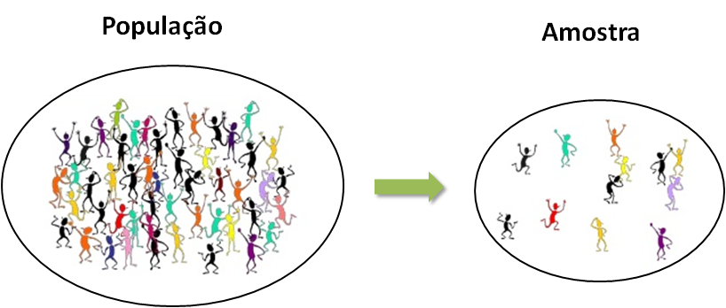
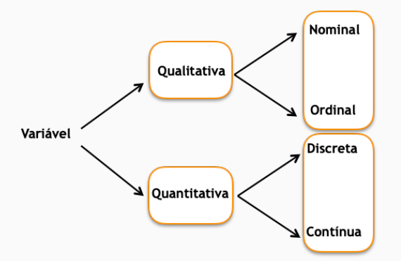

# Conceitos iniciais

## População

A população é o conjunto de todos os elementos sob investigação, é sobre quem é a pergunta. São alguns exemplos:
 
 1. Deseja-se avaliar se a discordância de peso de fetos gemelares aumenta o risco de óbito fetal. 
 
**População**: fetos gemelares.
 
2. Deseja-se saber se um novo tratamento para hipertensão grave é ou não efetivo. 

**População**: todas as pessoas que sofrem de hipertensão grave.
 
No estudo sobre o uso de progesterona em gestações gemelares, uma pessoa bem intencionada, mas sem conhecimento de Estatística, poderia pensar: "como gestação gemelar é de alto risco para prematuridade, assim como gestação com colo curto, em que neste último já é protocolo o uso de progesterona, podemos também usar progesterona em gestações gemelares sem a necessidade de estudo para essa população". No entanto, esse raciocínio não está correto, pois nos estudos de colo curto só consideram gestações únicas, ou seja, não é estudada a população de gestações gemelares. 

Essa discussão é importante, pois a extrapolação de resultado de uma população para outra não tem embasamento Estatístico e qualquer tipo de extrapolação dessa natureza deveria ser evitada. 

## Amostra

Muitas vezes não é possível acessar toda a população para estudarmos as características de interesse. Essa impossibilidade pode ser devido a razões econômicas, geográficas e/ou éticas.

Devido às dificuldades para se observar todos os elementos da população, alguns deles são considerados para o estudo. Este subconjunto representativo da população é denominado de **amostra**.

```{r popAmostra, echo=FALSE, fig.cap="\\label{fig:popamos}Esquema de população e amostra", out.width = '100%'}

```

Assim, a motivação de obter uma amostra se deve pela inviabilidade ou até mesmo impossibilidade de se observar toda a população. Como vantagens da amostra, podemos citar: redução de custos, redução de tempo de coleta e reprodução satisfatória da realidade, se a amostra for representativa. A desvantagem se deve pelo motivo desta poder carregar vícios quando feita sem os devidos cuidados.

A técnica considerada para selecionar amostra representativa da população de interesse é a **amostragem**. A escolha da técnica de amostragem depende de muitas questões e decisões específicas de cada projeto. 

Pela experiência em pesquisas na área médica, a definição da técnica de amostragem não é suficiente quando é planejada a coleta da amostra. O que precisa ser definido é o plano amostral. 

> **Plano amostral:**
> Estratégias e especificações metodológicas e estatísticas com o intuito de avaliar a questão científica de maneira adequada. 

No plano amostral, algumas questões precisam ser pensadas:

* Está claramente definida a população de interesse?

* O desenho do estudo é adequado?

*  Como será a amostragem?

* O tamanho da amostra é suficiente?

* Estão bem definidas as limitações do estudo?

*  O estudo é viável frente a custo, tempo e disponibilidade das unidades?

* Existem variáveis confundidoras? 

* Devo pensar em uma análise entre observadores?


## Variáveis {#variaveis}
Definimos aqui uma variável como sendo uma característica de interesse associada a uma população. Uma variável pode ser classificada em dois tipos:

- **Qualitativas**: apresentam como possíveis realizações uma qualidade (ou atributo) do indivíduo pesquisado. Exemplos: sexo, grau de instrução, estado civil, classe social, presença de diabetes (sim ou não) etc.

- **Quantitativas**: apresentam como possíveis realizações números resultantes de uma contagem ou de uma mensuração. Exemplos: número de filhos, salário, temperatura, pressão arterial, concentração de alguma substância etc.

Ainda, uma **variável qualitativa** pode ser dividida em **ordinal** ou **nominal**, em que:

- **ordinal**: existe uma ordem nos seus resultados.
				Exemplo: grau de instrução, estadiamento de uma doença etc.

- **nominal**: não existe nenhuma ordenação nas possíveis realizações.
				Exemplo: sexo,  estado civil,  presença de diabetes etc.

Já uma **variável quantitativa** pode ser dividida em **discreta** ou **contínua**, em que:

- **discreta**: possíveis valores formam um conjunto finito ou enumerável de pontos e que resultam, frequentemente, de uma contagem. Exemplo: 
				número de filhos (0,1,2,...), quantidade de acidentes em um mês (0, 1, 2, ...), número de carros que passam no pedágio de Vitória para Vila Velha em 1 hora etc.
- **contínua**: características mensuráveis que assumem valores em um intervalo de números reais. Exemplo: salário, temperatura, pressão arterial etc.

Podemos resumir os tipos de variáveis como o esquema na Figura \@ref(fig:tiposVars).

```{r tiposVars, echo=FALSE, fig.cap="Esquema dos tipos de variáveis", out.width = '100%'}

```

A identificação do tipo de variável é importante para a tabulação de dados de maneira correta e também para realizar a análise dos dados de maneira adequada. A seguir falamos sobre a tabulação de dados. 


## Tabulação de dados

Bases de dados são estruturas organizadas com o objetivo de permitir sua análise estatística. Em geral, cada linha
da planilha corresponde a uma unidade de investigação e cada coluna corresponde a uma variável. 

O início dos trabalhos da tabulação dos dados deve ser feito antes da coleta de dados. O planejamento da planilha contribui tanto para o entendimento do processo de coleta de dados quanto para a especificação das variáveis a serem avaliadas. Uma das primeiras medidas é a elaboração de um dicionário com a especificação das variáveis.  

Para mais detalhes sobre tabulação de dados, acesse https://daslab-ufes.github.io/materiais/ e clique em "Tabulacao de Dados".

## Importação de dados no R

### Extensão .txt ou .csv

Para importar dados para o R, com extensão .txt ou .csv, uma sugestão é utilizar o pacote `readr`. Como exemplo, consideramos um arquivo chamado dados1 que queremos importar para o R. 

```{r, eval=TRUE,include=TRUE,echo=FALSE,error=TRUE}
library(magrittr)
```

```{r, eval=FALSE,include=TRUE,echo=TRUE,error=TRUE}
library(readr)
dados_csv <- read_csv(file = "caminho-para-o-arquivo/dados1.csv")
dados_txt <- read_delim(file = "caminho-para-o-arquivo/dados1.txt", delim = " ")
```

O argumento `file=` representa o caminho onde o arquivo está alocado. Se o arquivo estiver no diretório de trabalho (quando criamos o projeto e colocamos os arquivos de dados na pasta criada pelo projeto), não precisa especificar o caminho até o arquivo, como segue:

```{r, eval=FALSE,include=TRUE,echo=TRUE,error=TRUE}
dados_csv <- read_csv(file = "dados1.csv")
dados_txt <- read_delim(file = "dados1.txt", delim = " ")
```

O argumento `delim=` indica qual o separador das colunas no arquivo de texto.

Outra opção para leitura de arquivo .txt é usar a função `read.table` que já está salva na base, ou seja, não é necessário instalar pacotes. 

```{r, eval=FALSE,include=TRUE,echo=TRUE,error=TRUE}
dados_txt2 <- read.table(file="dados1.txt",header=T)
```

O argumento `header=` indica se a primeira linha do arquivo consta o nome das variáveis. Se for T (TRUE), a primeira linha é indicada como nome das variáveis. O _default_ (padrão se o usuário não mudar o argumento) é `header=F`. 

Vale ressaltar que para cada função `read_`, existe uma respectiva função `write_` para salvar o arquivo no formato de interesse. Como exemplo, queremos salvar a base de dados mtcars na pasta do meu computador com o nome cars: 

```{r, eval=FALSE,include=TRUE,echo=TRUE,error=TRUE}
write_csv(x = mtcars, path = "cars.csv")
write_delim(x = mtcars, delim = " ", path = "cars.txt"))
```

### Arquivos em Excel

O pacote `readxl` pode ser utilizado para leitura de arquivos do Excel, como .xls e xlsx.

```{r, eval=FALSE,include=TRUE,echo=TRUE,error=TRUE}
library(readxl)
dados_excel <- read_xls(path = "dados1.xls") #Leitura do arquivo .xls
dados_excelx <- read_xlsx(path = "dados1.xlsx") #Leitura do arquivo .xlsx
```

Dentre os argumentos dessas funções (veja o `help()`de cada uma delas), o argumento `na` indica quais strings (textos) devem ser interpretados como `NA`. O _default_ é considerar espaço em branco no excel. 

Uma maneira mais simples é a utilização da função `read_excel()`, pois ela auto detecta a extensão do arquivo.
```{r, eval=FALSE,include=TRUE,echo=TRUE,error=TRUE}
library(readxl)
dados_excel1 <- read_excel(path = "dados1.xls")
dados_excelx1 <- read_excel(path = "dados1.xlsx")
```

Podemos também exportar um arquivo em excel (.xls e .xlsx) ao considerar a função `write_xlsx` do pacote `writexl`. Suponha que temos o interesse em salvar a base de dados `dados` em excel na pasta do computador (exportar) com o nome de `dados_correto`:
```{r, eval=FALSE,include=TRUE,echo=TRUE,error=TRUE}
library(writexl)
write_xlsx(dados, "dados_correto.xlsx")
```


### Arquivos de outros softwares

Para ler dados salvos em extensão de outros softwares, SPSS, STATA e SAS, podem ser utilizadas as funções do pacote `haven`. 

```{r, eval=FALSE,include=TRUE,echo=TRUE,error=TRUE}
library(haven)
dados_stata <- read_stata("dados1.dta")
dados_spss <- read_spss("dados1.sav")
dados_sas <- read_sas("dados1.sas7bdat")  
```

Outra opção de pacote para importação de dados de outros softwares é o `foreign`. Além do SAS, STAT e SPSS, ele também lê dados do Octave, Minitab e Epi Info. 


## Análise de consistência e tratamento dos dados {#consistencia}

O tratamento dos dados toma muitas vezes a maior parte do tempo de uma análise estatística. 

A análise de consistência consiste em realizar uma primeira análise dos dados com o intuito de encontrar inconsistências. São exemplos de inconsistências:

* boas práticas para nome das variáveis; 
* como erros de digitação;
* indivíduos imputados mais de uma vez na planilha de dados de maneira errada; 
* identificar casos missings e avaliar se a observação está ausente de maneira correta ou não;
* identificar as categorias de variáveis qualitativas.

Para exemplificar o que foi discutido, consideramos os dados fictícios de $n=104$ gestações gemelares, apresentado no Capítulo 2. O dicionário contém a explicação das variáveis, a identificação dos valores ausentes de cada variável e o rótulo das categorias de variáveis qualitativas. Uma boa prática na tabulação dos dados é manter o dicionário junto com a base de dados. Se a tabulação for realizada no Excel, por exemplo, manter o dicionário em uma outra aba.

### Importação dos dados
 
```{r, eval=TRUE,include=TRUE,echo=TRUE,error=TRUE}
library(readxl)
dados <- read_excel(path = "dataset/dados_gemelares.xlsx")
dados
```

**Exercício**: Na base em excel, substitua o espaço em branco (dados faltantes) por NA e rode o seguinte comando:

```{r, eval=FALSE,include=TRUE,echo=TRUE,error=TRUE}
dados <- read_excel(path = "dataset/dados_gemelares.xlsx",na="NA")
```

O default do missing é o espaço em branco. Acesse o help em ?read_excel e veja na `= ""`.  

### Arrumação da base de dados

Inicialmente, vamos verificar os nomes das variáveis na base de dados por meio da função `names`. Note que os nomes têm letras maiúsculas, espaços e acento. Utilizar os dados com essas características não impossibilita as futuras análises, mas pode atrapalhar quando precisamos selecionar algumas dessas variáveis. 

```{r, eval=TRUE,include=TRUE,echo=TRUE,error=TRUE}
names(dados)
```

uma boa prática consiste em padronizar os nomes das variáveis, até para facilitar a lembrança deles. Para isso, utilizaremos o pacote `janitor` para a arrumação da base de dados. Usamos a função `clean_names()` para primeiro ajuste dos nomes das variáveis.

```{r, eval=TRUE,include=TRUE,echo=TRUE,error=TRUE,message=FALSE}
library(janitor)
```

```{r, eval=TRUE,include=TRUE,echo=TRUE,error=TRUE}
dados <- janitor::clean_names(dados) 
```

Agora vamos ver como ficou o nome das variáveis:

```{r, eval=TRUE,include=TRUE,echo=TRUE,error=TRUE}
names(dados)
```
Veja que ele deixou todos os nomes minúsculos, substituindo o espaço por "_" e tirando acentos. Isso ajuda a evitar problemas futuros em algumas análises que não lidam muito bem com acentos e espaços nos nomes das variáveis. 

Outro problema comum é a presença de linhas e colunas vazias. Na base de dados em questão, não há linhas em branco, como pode ser visto na saída abaixo. 

```{r, eval=TRUE,include=TRUE,echo=TRUE,error=TRUE}
janitor::remove_empty(dados,"rows")
```

Propositalmente, incluí a coluna "oi" vazia para podermos eliminá-la com o comando abaixo: 

```{r, eval=TRUE,include=TRUE,echo=TRUE,error=TRUE}
dados <- janitor::remove_empty(dados,"cols") #limpando colunas vazias
dados
```

```{r, eval=FALSE,include=FALSE,echo=FALSE,error=FALSE,message=FALSE}
# BLOG sobre Janitor do curso-R: Esse banco de dados também tinha outro problema: linhas vazias. Na verdade, elas não eram completamente vazias, pois havia para algumas informações de identificação do paciente. Porém, nenhuma outra variável tinha sido computada.
dados %<>% 
  as.data.frame %>% 
  `row.names<-`(dados$id) %>%
  select(-id) %>% 
  remove_empty("rows") %>% 
  mutate(id = row.names(.)) %>%
  select(id, everything())

#Eu precisei converter para data.frame primeiro porque não é possível definir os nomes das linhas de uma tibble. Se a linha estivesse completamente vazia, bastaria usar diretamente a função remove_empty_rows().
dados %>% as_tibble()
```

### Identificação de casos duplicados

Uma boa prática consiste em identificar casos duplicados, isto é, identificar se há casos erroneamente repetidos. No exemplo, a variável chave é "id", em que cada indivíduo distinto apresenta um id distinto.  Para identificar casos duplicados pela variável chave "id", usamos a função `get_dupes` do pacote `janitor`. 

```{r, eval=TRUE,include=TRUE,echo=TRUE,error=TRUE}
janitor::get_dupes(dados, id)
```

No exemplo, note que os ID's = 2, 11, 17 e 23 aparecem duas vezes cada, o que não está correto para essa aplicação. 
Para eliminar linhas duplicadas identificadas, usamos a função `distinct` do pacote `dplyr`.

```{r, eval=TRUE,include=TRUE,echo=TRUE,error=TRUE,message=FALSE}
library(dplyr)
```

```{r, eval=TRUE,include=TRUE,echo=TRUE,error=TRUE}
dados <- dplyr::distinct(dados,id, .keep_all = TRUE)
dados
```

Ao chamar os dados, apenas as dez primeiras linhas são impressas na tela e as colunas que não couberam na largura do console serão omitidas. Vale ressaltar que, também são apresentadas a dimensão da tabela (no exemplo, 104 X 20) e as classes de cada coluna.

### Identificar problemas nas variáveis da base de dados 

Outra etapa importante na análise de consistência é identificar o tipo de variável e ver se o R está interpretando corretamente o tipo de cada variável. 

Temos na nossa base de dados colunas de data, além de variáveis qualitativas e quantitativas (veja o dicionário das variáveis na Figura \@ref(fig:dic1)). São as variáveis de data: "data_aval" e "data_nascimento". As variáveis qualitativas são: "grupo" (progesterona ou placebo), "corion" (mono ou dicoriônica), "cor_branco" (branca ou não branca), "ind_ap" (sim ou não), "tabagismo" (sim ou não), "alcool" (sim ou não) e "drogas" (sim ou não). As demais variáveis são quantitativas. 

Mas precisamos entender se o R realmente entendeu todas as variáveis da maneira correta. Uma maneira de identificar isso e também de ver algumas descritivas das variáveis que nos auxiliam a ver possíveis inconsistências na base de dados é a a função `skim` do pacote `skimr`. 


```{r, eval=TRUE,include=TRUE,echo=TRUE,error=TRUE}
skimr::skim(dados)
```

No R, as variáveis qualititativas são nomeadas "factor", as variáveis quantitativas são nomeadas "numeric" e as variáveis de data são "date". Note que na importação dos dados o R não entendeu corretamente os tipos de variáveis. Mas vamos corrigir isso no que segue. 

Começando pela data, vamos rodar o seguinte código:
```{r, eval=TRUE,include=TRUE,echo=TRUE,error=TRUE}
dados$data_aval  <- as.Date(dados$data_aval)
dados$data_nascimento  <- as.Date(dados$data_nascimento)
```
A função `as.Date` informa para o R que a variável do seu argumento é de data. Vamos ver como ficou:
```{r, eval=TRUE,include=TRUE,echo=TRUE,error=TRUE}
skimr::skim(dados)
```

Agora vamos lidar com as variáveis qualitativas. Veja que para "corion" foi identificada como _character_. Isso acontece porque ela foi tabulada como texto. Já as demais variáveis qualitativas estão identificadas como _numeric_, pois na tabulação suas categorias estão codificadas com números. Para então dizer ao R o verdadeiro tipo dessas variáveis, vamos utilizar os seguintes comandos:
```{r, eval=TRUE,include=TRUE,echo=TRUE,error=TRUE}
  dados$grupo <- as.factor(dados$grupo)
  dados$corion <- as.factor(dados$corion)
  dados$cor_branco <- as.factor(dados$cor_branco)
  dados$ind_ap <- as.factor(dados$ind_ap)
  dados$tabagismo <- as.factor(dados$tabagismo)
  dados$alcool <- as.factor(dados$alcool)
  dados$drogas <- as.factor(dados$drogas)
```
A função `as.factor` é análoga à função `as.Date`, mas agora informando que as variáveis no argumento da função são qualitativas (factor). Vamos ver como ficou:
```{r, eval=TRUE,include=TRUE,echo=TRUE,error=TRUE}
skimr::skim(dados)
```
Veja que agora as variáveis qualitativas da base estão identificadas no bloco _factor_. 

Mas ainda sobre as variáveis qualitativas, podemos identificar algumas inconsistências. Começando pela variável "cor_branco", tem uma categoria 3, o que está errado (1 - branca e 2- não branca). Para poder corrigir essa observação, vamos primeiro identificar quem é esse caso. Para isso, usamos o seguinte comando:
```{r, eval=TRUE,include=TRUE,echo=TRUE,error=TRUE}
dados[dados$cor_branco==3,]
```
Identificamos que o caso é id=9. O pesquisador viu em seus registros que foi um erro de digitação, e o correto é 1 (cor branca). Vamos então corrigir esse ponto na base de dados:
```{r, eval=TRUE,include=TRUE,echo=TRUE,error=TRUE}
dados$cor_branco <- ifelse(dados$id==9,1,dados$cor_branco)

#precisamos informar novamente ao R que cor_branco é fator:
dados$cor_branco <- as.factor(dados$cor_branco)
```
A função `ifelse` tem três argumentos. No primeiro, a condição é colocada (no exemplo, se a variável id for igual a 9), o segundo argumento é o que retorna se a condição for verdadeira (no exemplo, se id for realmente igual a 9, a variável "cor_branco" recebe 1) e, por fim, o último argumento é o que retorna se a condição for falsa (se id não for igual a 9 - todas as outras observações da base de dados, a variável "cor_branco" continua com o valor que está).

Outra variável qualitativa com algum problema aparente é "corion". Essa variável tem duas categorias: mono e dicoriônica, mas perceba que o R está entendendo que ela tem 4 categorias. Isso acontece porque ela é uma variável de texto (caractere) e o R é caso-sensível a letras maiúsculas e minúsculas (o R entende as 4 categorias: Mono, MONO, Di e DI). Por isso, devemos corrigir e deixar todas as respostas "mono" escritas da mesma maneira e fazer o mesmo com a categoria "di".

Para lidar com variáveis de texto (como é o caso de "corion"), um pacote no R bastante útil é o `stringr`. No nosso caso, conseguimos resolver o problema ao colocar todas as palavras em letra minúscula. Para isso, usamos a função `str_to_lower` do pacote `stringr`:
```{r, eval=TRUE,include=TRUE,echo=TRUE,error=TRUE}
dados$corion <- stringr::str_to_lower(dados$corion)
```
Como usei uma função para variáveis de texto, preciso avisar novamente ao R que "corion" é fator:
```{r, eval=TRUE,include=TRUE,echo=TRUE,error=TRUE}
dados$corion <- as.factor(dados$corion)
```

Ótimo! Corrigimos as inconsistências das variáveis qualitativas. Mas outra questão surge: como faço para usar um rótulo nos números codificados nas categorias das variáveis qualitativas? Para o grupo, por exemplo, em vez de aparecer 1 quero que apareça placebo. 

Para isso, vamos utilizar o pacote `forcats` que lida com variáveis qualitativas (categóricas). Para renomear as categorias das variáveis, vamos usar a função `fct_recode` desse pacote:
```{r, eval=TRUE,include=TRUE,echo=TRUE,error=TRUE}
dados$grupo <- forcats::fct_recode(dados$grupo,
                                        placebo = "1",
                                        progest = "2")

# Agora vamos para a variável cor_branco  (1- branca e 2- nbranca)
dados$cor_branco <- forcats::fct_recode(dados$cor_branco,
                                branca = "1",
                                nbranca = "2")

# Agora vamos para a variável ind_ap (1- sim e 0 -não)
dados$ind_ap <- forcats::fct_recode(dados$ind_ap,
                                   sim = "1",
                                   nao = "0")

# Agora vamos para a variável tabagismo (1- sim e 0 -não)
dados$tabagismo <- forcats::fct_recode(dados$tabagismo,
                                    sim = "1",
                                    nao = "0")

# Agora vamos para a variável alcool  (1- sim e 0 -não)
dados$alcool  <- forcats::fct_recode(dados$alcool,
                                       sim = "1",
                                       nao = "0")

# Agora vamos para a variável drogas  (1- sim e 0 -não)
dados$drogas  <- forcats::fct_recode(dados$drogas,
                                     sim = "1",
                                     nao = "0")

```
Aqui vale mais uma dica: se você rodar a função `View(dados)` vai abrir uma janela com a planilha dos dados para visualização. Aparecerá como segue:

```{r view, echo=FALSE, fig.cap="Tela dos dados após comando View(dados)", out.width = '100%'}

```

Finalmente chegamos nas variáveis quantitativas. Uma forma de identificar problemas em variáveis quantitativas é avaliar os valores mínimo e máximo de cada variável e ver se tem algum valor impossível para a mesma. 

Veja que tem uma altura de 163. A unidade de medida é em metros e a altura em questão foi um erro de digitação.
O certo era 1.63. Então vamos primeiro identificar o caso e depois vamos corrigir.
```{r, eval=TRUE,include=TRUE,echo=TRUE,error=TRUE}
dados[dados$alt==163,]
```
O caso em questão é o id=27 e vamos novamente usar a função `ifelse` para substituir o valorr:
```{r, eval=TRUE,include=TRUE,echo=TRUE,error=TRUE}
dados$alt <- ifelse(dados$id==27,1.63,dados$alt)
```
Há também um valor absurdo para "ig_aval" (idade gestacional da avalição) de 83.86. Vamos identificar o id para depois corrigir:
```{r, eval=TRUE,include=TRUE,echo=TRUE,error=TRUE}
dados[dados$ig_aval==83.86,]
```
Como podemos observar, o id=21 é o caso inconsistente para "ig_aval" e o pesquisador checou que o correto é 33.86. Vamos então corrigir novamente com a função `ifelse`.
```{r, eval=TRUE,include=TRUE,echo=TRUE,error=TRUE}
dados$ig_aval <- ifelse(dados$id==21,33.86,dados$ig_aval)
```

Agora está tudo certo?
```{r, eval=TRUE,include=TRUE,echo=TRUE,error=TRUE}
skimr::skim(dados)
```

## Transformação dos dados

Nessa parte do material discutiremos como fazer algumas transformações úteis nas variáveis. Para isso, utilizaremos as funções do pacote `dplyr`, um pacote bastante útil para a manipulação de dados. 

### Transformação de variáveis quantitativas

Primeiramente, temos o interesse em criar a variável IMC, dada pelo peso (em kg) dividido pela altura (em metros) ao quadrado. Para isso, usamos a função `mutate` do `dplyr`: 
```{r, eval=TRUE,include=TRUE,echo=TRUE,error=TRUE}
dados <- dplyr::mutate(dados,imc = peso_pre/(alt^2))
```
Vamos ver então como ficou:
```{r, eval=TRUE,include=TRUE,echo=TRUE,error=TRUE}
skimr::skim(dados$imc) #coloquei só imc para só fazer descritivas para imc.
```
Note que há três valores ausentes para "imc", uma vez que há dois valores ausentes para "alt" e outro para "peso_pre". 

Observe que na planilha tem duas colunas sobre idade gestacional: igp_semanas (idade gestacional em semanas fechadas) e igp_dia (dias ainda não de 1 semana completa). Vamos criar uma coluna que combine essas duas informações e que transforme os dias em semanas de maneira fracionada. 

```{r, eval=TRUE,include=TRUE,echo=TRUE,error=TRUE}
dados <- dplyr::mutate(dados,igp = igp_semana+igp_dia/7)
```
Vamos ver então como ficou:
```{r, eval=TRUE,include=TRUE,echo=TRUE,error=TRUE}
skimr::skim(dados$igp) #coloquei só igp para só fazer descritivas para igp.
```

### Transformação de variáveis qualitativas

A variável "gesta" indica o número de gestações, contando com a atual da gestante em gestão. Logo, uma gestante com gesta=1 está em sua primeira gestação, ou seja, é primigesta. Queremos criar uma nova variável indicadora de gestação primigesta. Há diferentes forma de fazer isso. Vamos usar o comando `ifelse` já utilizado anteriormente:
```{r, eval=TRUE,include=TRUE,echo=TRUE,error=TRUE}
dados$primigesta <- ifelse(dados$gesta==1,1,0)
```
Agora vamos recodificar primigesta com o nome de cada categoria: 
```{r, eval=TRUE,include=TRUE,echo=TRUE,error=TRUE}
dados$primigesta <- as.factor(dados$primigesta)
dados$primigesta <- forcats::fct_recode(dados$primigesta,
                                nao = "0", 
                                sim = "1")
```

Outra variável qualitativa que é função de uma variável quantitativa da planilha é a prematuridade. Definimos aqui prematuridade se idade gestacional do parto for menor que 37 semanas.  
```{r, eval=TRUE,include=TRUE,echo=TRUE,error=TRUE}
dados$prematuridade <- ifelse(dados$igp<37,1,0)
```
Agora vamos recodificar "prematuridade" com o nome de cada categoria: 
```{r, eval=TRUE,include=TRUE,echo=TRUE,error=TRUE}
dados$prematuridade <- as.factor(dados$prematuridade)
dados$prematuridade <- forcats::fct_recode(dados$prematuridade,
                                nao = "0", 
                                sim = "1")
```
Vamos ver então como ficou:
```{r, eval=TRUE,include=TRUE,echo=TRUE,error=TRUE}
skimr::skim(dados,primigesta,prematuridade) 
```
Veja que coloquei "primigesta" e "prematuridade" no segundo e terceiro argumento do `skim`, respectivamente, para apenas retornar as descritivas dessas duas variáveis. 

**Exercício**: 

1) Crie a variável indicador_aborto (sim e nao) - sim se aborto >=1 e nao se aborto=0. 

2) Crie a variável primipara (sim e nao) - sim se para >=1 e nao se para=0. 

### Manipulação de datas

Na base de dados, há duas variáveis de data: data da avaliação e data do nascimento. A diferença entre as duas datas, em anos, é a idade da gestante no momento da avaliação. Para realizar operações com data, usaremos o pacote `lubridate`. 

A data está salva no formato ano-mês-dia e por isso usamos a função `ymd(.)` para as variáveis de data. Para calcular a diferença entre as data, usamos a função `$%--%$`, atribuindo ao objeto intervalo. Por fim, obtemos a idade ao dividir o intervalo por ano.  

```{r, eval=TRUE,include=TRUE,echo=FALSE,error=FALSE,message=FALSE}
library(lubridate)
```

```{r, eval=TRUE,include=TRUE,echo=TRUE,error=TRUE}
intervalo <- lubridate::ymd(dados$data_nascimento)%--%  lubridate::ymd(dados$data_aval)
dados$idade <- intervalo / lubridate::dyears(1)  #número de anos
dados$idade <- trunc(dados$idade) #usamos a idade completada 
```
A última linha do código acima utiliza a função `trunc` para truncar a idade para não usar a fração dos meses da idade ainda não completa e sim usar a idade completada no último aniversário. 


Vale ressaltar que há várias funções importantes para lidar com variáveis de data no pacote `lubridate`. Para mais detalhes, ver a [documentação do lubridate](https://cran.r-project.org/web/packages/lubridate/vignettes/lubridate.html).

### Filtragem de observações

Uma função bastante importante quando estamos analisando dados é filtrar de acordo com uma condição de interesse. Suponha que temos interesse em realizar uma determinada análise apenas com gestantes com menos de 23 anos. Para selecionar apenas as gestantes mais novas, podemos utilizar a função `filter` do pacote `dplyr`. 

```{r, eval=TRUE,include=TRUE,echo=TRUE,error=TRUE}
dados_jovens <- filter(dados,idade<23)
```
Veja que agora o objeto dados_jovens é a base de dados apenas com aquelas cuja idade é menor que 23 (use o comando `View(dados_jovens)` para verificar).

Utilizando os operadores lógicos "&" (e) e "|" (ou), conseguimos realizar algumas condições, como mostrado no exemplo abaixo.

Agora, queremos selecionar apenas as gestantes mais novas e do grupo progesterona. Para isso:
```{r, eval=TRUE,include=TRUE,echo=TRUE,error=TRUE}
dados_jovens_progest <-  filter(dados,idade<23 & grupo=="progest")
```

Acho que aqui vale uma nota sobre o pacote `dplyr` e por isso dediquei uma subseção para ele, no que segue. 

#### Pacote dplyr

O `{dplyr}` é um pacote muito útil para realizar transformação de dados.

Suas principais funções são:

* filter() - filtra linhas;

* select() - seleciona colunas;

* arrange() - ordena a base;

* mutate() - cria/modifica colunas.


Já falamos das funções `filter` e `mutate` anteriormente, então falamos brevemente das outras funções adiante.

A função `select()` seleciona colunas (variáveis). Vamos supor que eu tenha interesse em criar um objeto só com as variáveis "id", "grupo" e "prematuridade".

```{r, eval=TRUE,include=TRUE,echo=TRUE,error=TRUE}
dados_s <- dplyr::select(dados,id, grupo, prematuridade)
```
Veja em `View(dados_s)` que essa base de dados só contém as colunas selecionadas. 


Sempre quando queremos retirar algo do banco de dados, colocamos um "-" antes da variável. No exemplo abaixo, queremos retirar "igp_semana" e "igp_dia". 

```{r, eval=TRUE,include=TRUE,echo=TRUE,error=TRUE}
dados_s1 <- dplyr::select(dados,-igp_semana,-igp_dia)
```
Veja em `View(dados_s1)` que essa base de dados só contém as colunas selecionadas. 

Com a função `arrange()`, conseguimos ordenar a base de acordo com uma ou mais colunas. Para gerar uma ordem descrescente de alguma variável, utilizamos a função `desc` como segue:

```{r, eval=TRUE,include=TRUE,echo=TRUE,error=TRUE}
dados_cres <- dplyr::arrange(dados,alt)
```

```{r, eval=TRUE,include=TRUE,echo=TRUE,error=TRUE}
dados_decres <- dplyr::arrange(dados,desc(alt))
```
No primeiro código acima, ordenamos a planilha em ordem crescente pela altura. Já no segundo código, ordenamos a planilha em ordem decrescente pela altura (a primeira observação na planilha dados_decres é aquela cuja gestante é a mais alta). 

## Exercícios 

### Teóricos
1. Por que é importante ter a população bem definida?

2. Por que é importante pensar em todo planejamento amostral em vez de pensar apenas no cálculo do tamanho amostral?

3. O que é uma variável confundidora?

4. Classifique as seguintes variáveis:

  a. Sexo
  
  b. Altura
  
  c. Peso
  
  d. Fuma (sim ou não) 
  
  e. Tolerância ao cigarro (indiferente, incomoda pouco, incomoda muito)
  
  f. Consumo de café (nunca, 1 a 2 vezes por semana, 3 a 6 vezes por semana, uma vez por dia, $>$ 1 vez por dia) 
  
  g. Horas de atividade física por semana

### Práticos no R

5. Considere a base de dados "dados_gemelares":

  a.  Crie a variável igp (idade gestacional do parto) 
 obtida ao somar igp_semana e igp_dia/7.
 
  b. Crie a variável indicador_aborto (sim e não) - sim se aborto >=1 e não se aborto=0. 

  c. Crie a variável primipara (sim e não) - não se para >=1 e sim se para=0. 

  d. Obtenha uma nova base de dados ao considerar só os casos primigestas (note que queremos filtrar quem é primigesta=sim).

  e. Obtenha uma nova base de dados ao considerar só os casos que não fumam e não fazem uso de álcool.

6. Considere agora a base de dados "dados_gemelares_2". Realize uma análise de consistência similar a que realizamos para a base de dados "dados_gemelares" na Seção  \@ref(consistencia). 

 


