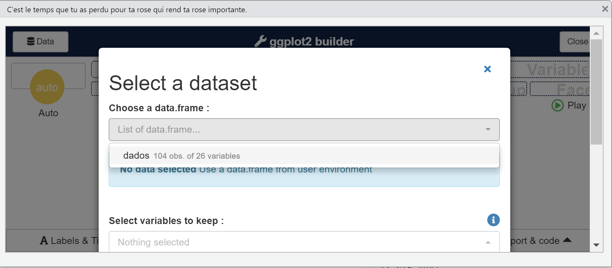

# Análise exploratória dos dados 

Neste capítulo consideramos a análise descritiva das variáveis da base de dados de interesse.

A análise descritiva pode ser vista como o conjunto de técnicas numéricas e gráficas utilizadas para detectar padrões, resumir informação e apresentar visivelmente características de um conjunto de dados. Assim, podemos identificar [@morettin2020introduccaoa]:

i) qual a frequência com que cada valor aparece no conjunto de dados ou seja, qual a distribuição de frequências dos
dados?

ii) quais são alguns valores típicos do conjunto de dados, como mínimo e máximo?

iii) qual seria um valor para representar a posição (ou localização) central do conjunto de dados?

iv) qual seria uma medida da variabilidade ou dispersão dos dados?

v) existem valores atípicos ou discrepantes (_outliers_) no conjunto de dados?

vi) os dados podem ser considerados simétricos?

Para isso, utilizamos: 

- tabelas de frequências;
- medidas para resumir os dados;
- gráficos. 

As técnicas empregadas na análise descritiva dependem do tipo de variáveis que compõem o conjunto de dados em questão. Por isso, recomendo que reveja a Seção \@ref(variaveis) sobre os tipos de variáveis. 

## Tabelas de frequências

Uma tabela contendo as frequências absolutas (número de casos) e/ou relativas (número de casos relativo ao total) para cada categoria da variável qualitativa é chamada de distribuição de frequências dessa variável. 

Ao considerar a base de dados de gestações gemelares, vamos contruir uma tabela de frequências para a variável "prematuridade". No R, há diversas maneiras de obter uma tabela de frequências. Vamos utilizar aqui a função `freq` do pacote `summarytools`. 

```{r, eval=TRUE,include=FALSE,echo=FALSE,error=FALSE}
library(readxl)
dados <- read_excel(path = "dataset/dados_gemelares.xlsx")
dados <- janitor::clean_names(dados) 
dados <- dplyr::distinct(dados,id, .keep_all = TRUE)
dados$cor_branco <- ifelse(dados$id==9,1,dados$cor_branco)
dados$corion <- stringr::str_to_lower(dados$corion)
dados$grupo <- as.factor(dados$grupo)
dados$corion <- as.factor(dados$corion)
dados$cor_branco <- as.factor(dados$cor_branco)
dados$ind_ap <- as.factor(dados$ind_ap)
dados$tabagismo <- as.factor(dados$tabagismo)
dados$alcool <- as.factor(dados$alcool)
dados$drogas <- as.factor(dados$drogas)
dados$grupo <- forcats::fct_recode(dados$grupo,
                                        placebo = "1",
                                        progest = "2")

# Agora vamos para a variável cor_branco  (1- branca e 2- nbranca)
dados$cor_branco <- forcats::fct_recode(dados$cor_branco,
                                branca = "1",
                                nbranca = "2")

# Agora vamos para a variável ind_ap (1- sim e 0 -não)
dados$ind_ap <- forcats::fct_recode(dados$ind_ap,
                                   sim = "1",
                                   nao = "0")

# Agora vamos para a variável tabagismo (1- sim e 0 -não)
dados$tabagismo <- forcats::fct_recode(dados$tabagismo,
                                    sim = "1",
                                    nao = "0")

# Agora vamos para a variável alcool  (1- sim e 0 -não)
dados$alcool  <- forcats::fct_recode(dados$alcool,
                                       sim = "1",
                                       nao = "0")

# Agora vamos para a variável drogas  (1- sim e 0 -não)
dados$drogas  <- forcats::fct_recode(dados$drogas,
                                     sim = "1",
                                     nao = "0")
dados <- dplyr::mutate(dados,igp = igp_semana+igp_dia/7)
dados$prematuridade <- ifelse(dados$igp<37,1,0)
dados$prematuridade <- as.factor(dados$prematuridade)
dados$prematuridade <- forcats::fct_recode(dados$prematuridade,
                                nao = "0", 
                                sim = "1")

dados$ig_aval <- ifelse(dados$id==21,33.86,dados$ig_aval)
dados$alt <- ifelse(dados$id==27,1.63,dados$alt)
dados <- dplyr::mutate(dados,imc = peso_pre/(alt^2))
dados <- dplyr::mutate(dados,igp = igp_semana+igp_dia/7)
dados$primigesta <- ifelse(dados$gesta==1,1,0)
dados$primigesta <- as.factor(dados$primigesta)
dados$primigesta <- forcats::fct_recode(dados$primigesta,
                                nao = "0", 
                                sim = "1")
library(lubridate)
intervalo <- lubridate::ymd(dados$data_nascimento) %--%  lubridate::ymd(dados$data_aval)
dados$idade <- intervalo / lubridate::dyears(1)  #número de anos
dados$idade <- trunc(dados$idade) #usamos a idade completada
```

```{r, eval=TRUE,include=TRUE,echo=TRUE,error=FALSE,message=FALSE}
library(summarytools)
```


```{r, eval=TRUE,include=TRUE,echo=TRUE,error=FALSE,message=FALSE}
summarytools::freq(dados$prematuridade,cumul=FALSE)
```

Pela tabela acima, observamos que quase 58\% dos nascimentos gemelares foram prematuros e que não há observações faltantes para essa variável (linha $<NA>$ está vazia). Caso queira que não apareça na tabela a linha com dados faltantes, só é necessário acrescentar o argumento `report.nas =FALSE` na função, como segue:


```{r, eval=TRUE,include=TRUE,echo=TRUE,error=FALSE,message=FALSE}
summarytools::freq(dados$prematuridade,cumul=FALSE,
                   report.nas=FALSE)
```

Observe também que colocamos o argumento `cumul=FALSE`, indicando que não temos interesse em acrescentar na tabela a coluna com as frequências relativas acumuladas. Essa coluna é útil quando a variável é qualitativa ordinal, o que não é o caso da prematuridade. 

Outra dica importante é utilizar a função `view` (dessa vez tudo minúsculo). Veja que, ao utilizar `view(freq(dados$prematuridade,cumul=FALSE,report.nas=FALSE))`, a tabela aparecerá mais bonita no menu "Viewer" do RStudio. Dali você pode copiar para o destino de interesse. 


## Medidas resumo

Se utilizarmos uma tabela de frequências para uma variável quantitativa (especialmente no caso de variáveis contínuas), obteríamos frequências muito pequenas (em geral 1) para os diversos valores da variável, deixando de atingir o objetivo de resumir os dados.

Nesse sentido, apresentamos aqui medidas resumo que podem ser utilizadas para variáveis quantitativas. Essas serão divididas entre medidas de posição e medidas de dispersão. 

### Medidas de posição

As medidas de posição, como o nome diz, indicam posições de interesse da variável. Consideramos aqui as seguintes medidas: valor mínimo, valor máximo, moda, média, mediana e percentis. 

O **mínimo** é o menor valor observado e **máximo** é o maior valor observado. 

A moda, a média e a mediana são todas **medidas de posição central**: medidas que buscam descrever um  valor típico que a variável tende a apresentar.
 
A **moda** é o(s) valor(es) mais frequente(s). Vale citar que a moda também pode ser usada para variáveis qualitativas. 

A **média** é a medida obtida ao somar todos os valores da variável dividida pelo número de observações. Podemos interpretar a média como sendo um ponto de equilíbrio: os valores da variáveis são representados como pesos de mesma massa posicionados sobre uma reta de massa desprezível nas posições referentes aos valores da variável em questão. 

Já a **mediana** divide os dados de forma que 50\% deles são menores e 50\% deles são maiores que a mediana. 

Para considerar dados de posição não centrais, podemos citar os quantis. Um quantil de ordem p é um valor da variável que deixa $100p\%$ $(0 < p < 1)$ das observações à sua esquerda, ou seja, são menores que ele. 

São alguns quantis conhecidos:

- **Percentis** - valores inteiros de $100p\%$. O percentil 20, por exemplo, é o valor da variável que 20\% das observações apresentam menor que ele. 

- **Decis** - dados divididos em 10 partes iguais. O primeiro decil, por exemplo, é o percentil 10 e o sexto decil é o percentil 60. 

- **Quartis** - dados divididos em 4 partes iguais.  O primeiro quartil é o percentil 25, o segundo quartil é o percentil 50 e o terceiro quartil é o percentil 75. 
Vale notar que o segundo quartil é a mediana. 

### Medidas de dispersão

As medidas de dispersão são valores que quantificam quão dispersos os dados são. Consideramos aqui as seguintes medidas: amplitude, intervalo interquartil, variância e desvio padrão.  

A **amplitude** é a diferença entre o valor máximo e o valor mínimo. O **intervalo interquartil** é a diferença entre o terceiro e o primeiro quartil, ou seja, é a amplitude entre os 50\% dos dados centrais. 

Queremos uma medida de dispersão que não considere apenas dois valores da amostra (mínimo e máximo ou primeiro e terceiro quartis) e sim todos os dados. Uma medida bastante intuitiva seria considerar a soma dos desvios das observações em torno da média. Mas aí temos um problema: a soma dos desvios da média é sempre zero! Isso acontece porque sempre há desvios positivos e negativos que se anulam. Uma solução para essa questão é considerar alguma função que considere apenas o valor do desvio e não o seu sinal. Uma função candidata é a função quadrática (lembre que, por exemplo, $(-2)^2=4$). Nessa construção surge a **variância**: soma dos desvios quadrados dividida pelo total de observações, ou seja, a média dos desvios quadrados. Assim, a variância quantifica o quanto os dados estão dispersos da média, em média. 

Como a unidade de medida da variância é o quadrado da unidade de medida da variável correspondente, convém definir outra medida de dispersão que mantenha a unidade de medida original. Uma medida com essa propriedade é a raiz quadrada da variância, conhecida por **desvio padrão**.


No R, para obter essas medidas resumo vamos utilizar a função `descr` também do pacote `summarytools`.  No comando abaixo pedimos ao R as medidas descritivas da variável quantitativa "medida_colo". 

```{r, eval=TRUE,include=TRUE,echo=TRUE,error=FALSE,warning=FALSE,message=FALSE}
descr(dados$medida_colo)
```

Veja que a função retorna outras medidas resumo além daquelas citadas anteriormente. Se quiser uma tabela com algumas medidas resumo, podemos informar ao R por meio do argumento `stats`. Ainda, se quisermos que na tabela as medidas resumo fiquem na coluna, usamos o argumento `transpose = TRUE`, como segue:
```{r, eval=TRUE,include=TRUE,echo=TRUE,error=FALSE,warning=FALSE,message=FALSE}
descr(dados$medida_colo,stats = c("min", "mean", "med","sd","max"),
      transpose = TRUE) #sd é o desvio padrão
```

Outro pacote bastante interessante para medidas descritivas é o `modelsummary`. Destacamos algumas funções desse pacote:

- `datasummary_skim`: retorna as medidas descritivas das variáveis do banco de dados a depender do tipo identificado no argumento `type= ` (categorical ou numeric);

- `datasummary`: retorna as medidas descritivas das variáveis a depender de como monta os argumentos da função, permitindo retornar as medidas descritivas das variáveis quantitativas de interesse por categorias de outra(s) variável(is).


```{r, eval=TRUE,include=TRUE,echo=TRUE,error=FALSE,message=FALSE}
library(modelsummary)
```

Ao usar a função `datasummary_skim`, vamos obter as medidas descritivas das variáveis quantitativas (argumento `type = "numeric"`) e das variáveis qualitativas (argumento `type = "categorical"`), respectivamente:

```{r, eval=FALSE,include=TRUE,echo=TRUE,error=FALSE,warning=FALSE,message=FALSE}
datasummary_skim(
  dados,
  type = "numeric",
  histogram = FALSE
)
```

```{r, eval=FALSE,include=TRUE,echo=TRUE,error=FALSE,warning=FALSE,message=FALSE}
datasummary_skim(
  dados,
  type = "categorical"
)
```

Agora vamos comentar sobre a função mais interessante desse pacote, a função `datasummary`. Suponha que eu tenho interesse em obter as medidas descritivas das variáveis  "igp", "idade", "imc", "medida_colo" e "num_contra_ctg" por grupo (progesterona ou placebo), apresentando as seguintes medidas descritivas: média, mediana, desvio padrão, mínimo, máximo e tamanho da amostra válido (sem considerar observações faltantes para a variável em questão).


```{r, eval=TRUE,include=TRUE,echo=TRUE,error=FALSE,warning=FALSE,message=FALSE}
### Essas funções abaixo são auxiliares para calcular as descritivas
#em cenário de presença de dados faltantes
media <- function(x) mean(x, na.rm = TRUE)
medi <- function(x) median(x, na.rm = TRUE)
dp <- function(x) sd(x, na.rm = TRUE)
mini <- function(x) min(x, na.rm = TRUE)
maxi <- function(x) max(x, na.rm = TRUE)
n <- function(x) sum(!is.na(x))
```

```{r, eval=FALSE,include=TRUE,echo=TRUE,error=FALSE,warning=FALSE,message=FALSE}
datasummary((igp+idade+imc+medida_colo+num_contra_ctg)~
              grupo*(n+media+dp+mini+medi+maxi), data = dados)
```

Agora veja como fica se eu considerar as medidas descritivas das variáveis quantitativas por duas variáveis qualitativas:
```{r, eval=FALSE,include=TRUE,echo=TRUE,error=FALSE,warning=FALSE,message=FALSE}
datasummary(primigesta*grupo~(igp+idade+imc+medida_colo+
  num_contra_ctg)*(n+media+dp+mini+medi+maxi), data = dados)
```


Para mais detalhes sobre as medidas descritivas veja o Capítulo 3 de Morettin e Singer [@morettin2020introduccaoa].

## Tabelas cruzadas - duas variáveis qualitativas

Tabelas cruzadas ou tabelas de contingência são tabelas que apresentam frequências de duas variáveis qualitativas conjuntamente. 

No R, para obter tabelas cruzadas vamos utilizar a função `ctable` também do pacote `summarytools`.  No comando abaixo pedimos ao R uma tabela cruzada entre as variáveis qualitativas "grupo" e "prematuridade". 

```{r, eval=TRUE,include=TRUE,echo=TRUE,error=FALSE,warning=FALSE,message=FALSE}
ctable(dados$grupo,y=dados$prematuridade,prop="t")
```
No argumento `prop=` indica como será o cálculo das porcentagens apresentadas entre parênteses. Se o interesse for a porcentagem com relação ao total, o argumento é `prop="t"`. Se você desejar que a porcentagem seja calculada com relação às categorias da variável que está na linha é `prop="r"`:
```{r, eval=TRUE,include=TRUE,echo=TRUE,error=FALSE,warning=FALSE,message=FALSE}
ctable(dados$grupo,y=dados$prematuridade,prop="r")
```
E, por fim, se for de interesse que a porcentagem seja calculada com relação às categorias da variável que está na coluna é `prop="c"`:
```{r, eval=TRUE,include=TRUE,echo=TRUE,error=FALSE,warning=FALSE,message=FALSE}
ctable(dados$grupo,y=dados$prematuridade,prop="c")
```

## Gráficos

Um gráfico pode ser a maneira mais adequada para resumir e apresentar um conjunto de dados. Tem a vantagem de facilitar a compreensão de uma determinada situação que queira ser descrita, permitindo uma interpretação rápida e visual das suas principais características. 

A visualização dos dados é uma etapa importantíssima da análise estatística, pois é também a partir dela que criamos a intuição necessária para escolher o teste ou modelo mais adequado para o nosso problema.

No Capítulo 3 do livro de Morettin e Singer também tem um conteúdo bastante interessante sobre gráficos. Recomendamos sua leitura para a apresentação dos gráficos mais tradicionais em Estatística do ponto de vista mais teórico e, no que segue, discutimos como obter alguns gráficos no R. 

### Pacote ggplot2

Um pacote maravilhoso para gráficos no R é o `ggplot2`. A ideia por trás desse pacote é que é fato que um gráfico é um mapeamento dos dados a partir de atributos estéticos (cores, formas, tamanho) de formas geométricas (pontos, linhas, barras).

```{r, eval=TRUE,include=TRUE,echo=TRUE,error=FALSE,warning=FALSE,message=FALSE}
library(ggplot2)
```

**Atributos estéticos**

A função `aes()` descreve como as variáveis são mapeadas em aspectos visuais (qual variável será representada no eixo x, qual será representada no eixo y, a cor e o tamanho dos componentes geométricos etc) de formas geométricas definidas pelos geoms. Os aspectos que podem ou devem ser mapeados vão depender do tipo de gráfico que estamos querendo construir.

Aspectos visuais mais utilizados:

* color: altera a cor de formas que não têm área (pontos e retas);

* fill: altera a cor de formas com área (barras, caixas, densidades, áreas);

* size: altera o tamanho de formas;

* type: altera o tipo da forma, geralmente usada para pontos;

* linetype: altera o tipo da linha.

**Formas geométricas**

Os geoms definem qual forma geométrica será utilizada para a visualização das observações. A função `geom_point()` gera gráficos de dispersão transformando pares (x,y) em pontos. Veja a seguir outros geoms bastante utilizados:

* geom_line: para retas definidas por pares (x,y);

* geom_abline: para retas definidas por um intercepto e uma inclinação;

* geom_hline: para retas horizontais;

* geom_bar: para barras;

* geom_histogram: para histogramas;

* geom_boxplot: para boxplots;

* geom_density: para densidades;

* geom_area: para áreas.

Vamos fazer alguns gráficos para as variáveis da base de dados Gestações gemelares. 

**Gráfico de barras** - analisando uma variável qualitativa:

```{r, eval=TRUE,include=TRUE,echo=TRUE,error=FALSE,warning=FALSE,message=FALSE}
ggplot(dados, aes(x = prematuridade)) +
  geom_bar(fill = "blue") +
  labs(x = "Grupo", y = "Número de casos")
```

```{r, eval=TRUE,include=TRUE,echo=TRUE,error=FALSE,warning=FALSE,message=FALSE}
#No eixo y é porcentagem
ggplot(dados, aes(x = prematuridade)) +  
  geom_bar(aes(y = (..count..)/sum(..count..)),fill="purple") + 
  scale_y_continuous(labels=scales::percent) +
  ylab("Porcentagem")

```


**Gráfico de barras** - analisando duas variáveis qualitativas:
```{r, eval=TRUE,include=TRUE,echo=TRUE,error=FALSE,warning=FALSE,message=FALSE}
ggplot(dados, aes(prematuridade, group = grupo)) + 
  geom_bar(aes(y = ..prop.., fill = factor(..x..)), stat="count") + 
  scale_y_continuous(labels=scales::percent) +
  theme(legend.position = "none") +
  ylab("Porcentagem") +
  facet_grid(~grupo)
```

Mesmo gráfico acima, mas agora com a porcentagem escrita no gráfico:

```{r, eval=TRUE,include=TRUE,echo=TRUE,error=FALSE,warning=FALSE,message=FALSE}
ggplot(dados, aes(x=prematuridade, group = grupo))  + 
  geom_bar(aes(y = ..prop.., fill = factor(..x..)), stat="count") +
  geom_text(aes( label = scales::percent(..prop..),
                 y= ..prop.. ), stat= "count", vjust = -.1) +
  labs(y = "Porcentagem", fill=" ") +
  scale_y_continuous(labels = scales::percent) +
  theme(legend.position = "none")+
  facet_grid(~grupo)
```

Outra forma de fazer um gráfico de barras para duas variáveis qualitativas:

```{r, eval=TRUE,include=TRUE,echo=TRUE,error=FALSE,warning=FALSE,message=FALSE}
ggplot(dados,aes(x = grupo, fill = prematuridade)) +
  geom_bar() +
  scale_fill_hue() +
  labs(x = "Grupo", y = "Número de casos")
```

Veja o site para mais detalhes sobre gráfico de barras:
http://www.sthda.com/english/wiki/ggplot2-barplots-quick-start-guide-r-software-and-data-visualization#barplot-of-counts.

**Gráficos para variáveis quantitativas** - só uma variável quantitativa

Histograma:
```{r, eval=TRUE,include=TRUE,echo=TRUE,error=FALSE,warning=FALSE,message=FALSE}
ggplot(dados) +
  aes(x = idade) +
  geom_histogram(bins = 10L, fill = "#0c4c8a") +
  theme_minimal()
```

Boxplot:
```{r, eval=TRUE,include=TRUE,echo=TRUE,error=FALSE,warning=FALSE,message=FALSE}
ggplot(dados) +
  aes( y = alt,x="") +
  geom_boxplot(fill = "#0c4c8a") +
  labs(y = "Altura da gestante (em metros)") +
  theme_minimal()
```

**Gráficos para variáveis quantitativas** - variável quantitativa por uma variável de grupo:

```{r, eval=TRUE,include=TRUE,echo=TRUE,error=FALSE,warning=FALSE,message=FALSE}
ggplot(dados)+
  aes(x = grupo, y = num_contra_ctg) +
  geom_boxplot(fill = "red") +
  labs(x = "Grupo", y = "Número de contrações") +
  theme_minimal()
```

**Gráficos para variáveis quantitativas** - duas variáveis quantitativas:

Gráfico de dispersão:
```{r, eval=TRUE,include=TRUE,echo=TRUE,error=FALSE,warning=FALSE,message=FALSE}
ggplot(dados) +
  aes(x = imc, y = medida_colo) +
  geom_point(size = 1.84, colour = "#4292c6") +
  labs(x = "IMC", y = "Medida do colo") +
  theme_minimal()
```

Gráfico de dispersão identificando o grupo (progesterona ou placebo):

```{r, eval=TRUE,include=TRUE,echo=TRUE,error=FALSE,warning=FALSE,message=FALSE}
ggplot(dados) +
  aes(x = imc, y = medida_colo, colour = grupo) +
  geom_point(size = 2.02) +
  scale_color_hue() +
  labs(x = "IMC", y = "Medida do colo", color = "Grupo") +
  theme_minimal()
```

### Pacote esquisse

O pacote `esquisse` disponibiliza um _dashboard_ interativo para criação de gráficos por meio do `ggplot2`. 

```{r, eval=TRUE,include=TRUE,echo=TRUE,error=FALSE,warning=FALSE,message=FALSE}
library(esquisse)
```
 
Ao rodar o código `esquisser()`, abrirá a janela da Figura \@ref(fig:esquisse1), em que usuário escolhe a base de dados que trabalhará, e ao finalizar nessa janela abrirá a janela da Figura \@ref(fig:esquisse2) para fazer os gráficos. Um bom tutorial sobre a utilização do pacote `esquisse`: https://www.youtube.com/watch?v=VbzxNQAHUBw.

```{r, eval=FALSE,include=TRUE,echo=TRUE,error=FALSE,warning=FALSE,message=FALSE}
esquisse::esquisser() 
```

```{r esquisse1, echo=FALSE, fig.cap="Primeira tela do esquisser", out.width = '100%'}

```

```{r esquisse2, echo=FALSE, fig.cap="Segunda tela do esquisser", out.width = '100%'}

```


## Materiais complementares para análise exploratória dos dados

- Mercier F, Consalvo N, Frey N, Phipps A, Ribba B. From waterfall plots to spaghetti plots in early oncology clinical development. Pharm Stat. 2019 Oct;18(5):526-532. doi: 10.1002/pst.1944. Epub 2019 Apr 3. PMID: 30942559.

- Understanding waterfall plots. J Adv Pract Oncol. 2012 Mar;3(2):106-11. Gillespie TW1.

- Describing data: statistical and graphical methods. Radiology. 2002 Dec;225(3):622-8.Sonnad SS.3. In J, Lee S. Statistical data presentation. Korean Journal of Anesthesiology. 2017;70(3):267-276. doi:10.4097/kjae.2017.70.3.267.

## Exercícios sobre análise exploratória dos dados

1. Realize uma análise exploratória dos dados "dados_gemelares".  Faça as análises que achar pertinente e que obrigatoriamente contenha os seguintes itens:

– Apresente tabelas de frequências de todas as variáveis qualitativas;

– Apresente tabelas com as medidas descritivas de todas as variáveis quantitativas;

- Construa tabelas cruzadas de grupo (progesterona e placebo) com todas as outras variáveis quantitativas, apresentando a porcentagem por grupo (se a variável de grupo estiver na linha, pedir a porcentagem por linha).

– Selecione só as gestações dicoriônicas. Desses casos selecionados, apresente tabela com as medidas descritivas das variáveis quantitativas por grupo (progesterona e placebo);

– Apresente os seguintes gráficos:
    - Gráfico de barras conjuntamente de grupo e primigesta (gráfico de barras para duas variáveis).
    - Boxplot da medida do colo por grupo (progesterona e placebo).
    - Gráfico de dispersão entre número de contrações (eixo y) e medida do colo (eixo x). 
    - Refaça o gráfico de dispersão anterior, mas agora identificando o grupo (progesterona e placebo) pela cor do ponto. 
    
2. Realize uma análise exploratória dos dados "dados_gemelares_2".  Faça as análises que achar pertinente e que obrigatoriamente contenha os seguintes itens:


– Apresente tabelas de frequências de todas as variáveis qualitativas;

– Apresente tabelas com as medidas descritivas de todas as variáveis quantitativas;

- Construa uma tabela cruzada entre EDPS_antes_SN e	EDPS_depois_SN;

- Apresente uma tabela com as medidas descritivas da variável tempo_amamentacao_meses por grupo de amamentação. Refaça essa tabela, mas agora só com os casos sem depressão antes do parto (filtrando os casos EDPS_antes_SN=não). 

- Faça boxplot do tempo_amamentacao_meses por grupo de amamentação. 

- Faça um gráfico de dispersão EDPS antes versus EDPS depois. 


**Observação importante:** Interprete todas as análises realizadas.


